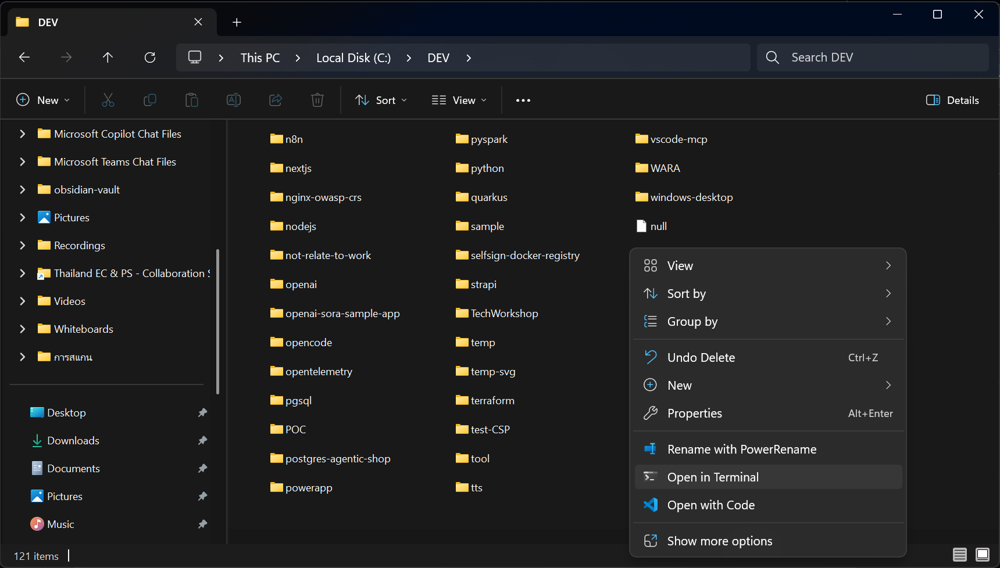
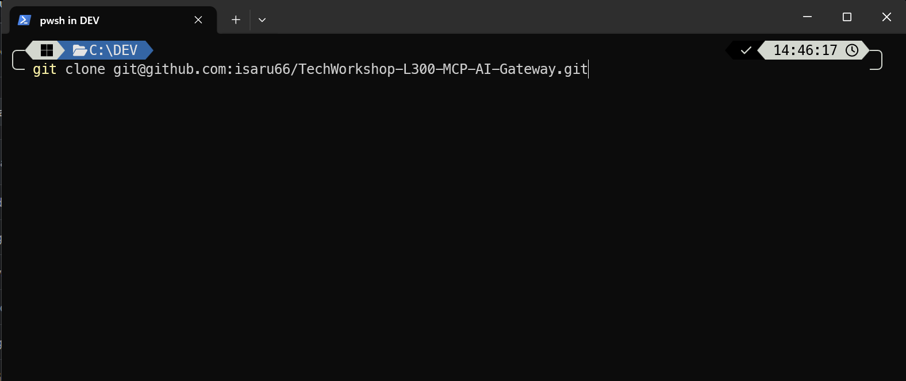
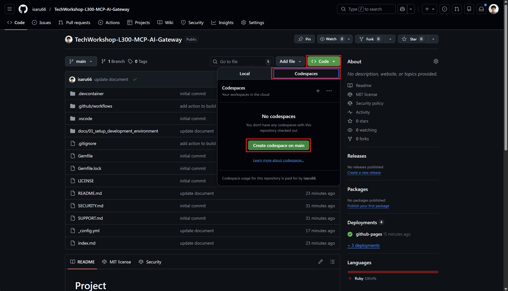

# Task 01 - Fork and clone the repository

## Introduction

Before setting up your development environment, you need to fork the workshop repository to your own GitHub account and clone it to your local machine. Forking the repository allows you to make changes and use GitHub Actions workflows in later exercises.

## Description

In this task, you will fork the workshop repository to your personal GitHub account and clone it to your local machine. If you choose to use a GitHub Codespace instead, you will also create the Codespace in this step.

## Success Criteria

- You have forked the repository to your personal GitHub account.
- You have cloned the forked repository to your local machine, **or** created a GitHub Codespace.

## Learning Resources

- Cloning a repository via the [command line](https://docs.github.com/en/github/creating-cloning-and-archiving-repositories/cloning-a-repository) or [GitHub Desktop](https://docs.github.com/en/desktop/contributing-and-collaborating-using-github-desktop/cloning-a-repository-from-github-to-github-desktop)
- [GitHub Codespaces overview](https://docs.github.com/en/codespaces/overview)

## Key Tasks

### 01: Clone the repository or create a Codespace

You have two options for setting up your environment:

**Option 1: Clone to your local machine**

Clone the repository to your local machine using the command line or GitHub Desktop. This option requires you to install software locally (covered in the next task).

<details markdown="block">
<summary><strong>Expand this section to view the solution</strong></summary>

Go to your folder that use for keeping Software development work. For example C:\DEV. Right click, then "Open in Terminal"



Once terminal open.

You can clone the repository using the following command:

```bash
git clone https://github.com/isaru66/TechWorkshop-L300-MCP-AI-Gateway.git
```



Then Open this folder in Visual Studio Code
```bash
cd TechWorkshop-L300-MCP-AI-Gateway
code .
```

</details>

**Option 2: Use a GitHub Codespace**

If you prefer not to install software locally, you can use a GitHub Codespace. The repository includes a `.devcontainer/devcontainer.json` file that pre-configures the Codespace with all the necessary tools.

{: .important }
> **Note:** In order to use GitHub Codespace, you must sign in with your personal GitHub account. If you don't have a GitHub account, create one first at [github.com](https://github.com).

<details markdown="block">
<summary><strong>Expand this section to view the solution</strong></summary>

1. Sign in to your personal GitHub account at [github.com](https://github.com).
2. Navigate to your forked repository on GitHub and select the **Code** button. 
3. Select the **Codespaces** tab and choose **Create codespace on main**.

```bash
https://github.com/isaru66/TechWorkshop-L300-MCP-AI-Gateway
```



The Codespace is pre-configured with the following tools:
- Azure CLI
- Azure Developer CLI (azd)
- Azure Bicep
- Python
- Node.js

And the following VS Code extensions:
- AI Foundry
- Azure Storage
- Bicep
- Azure MCP Server
- Azure Resource Groups
- Python

{: .note }
> You might be unable to perform some activities from a GitHub Codespace. Where possible, prefer working on your local machine for the full experience.

</details>
