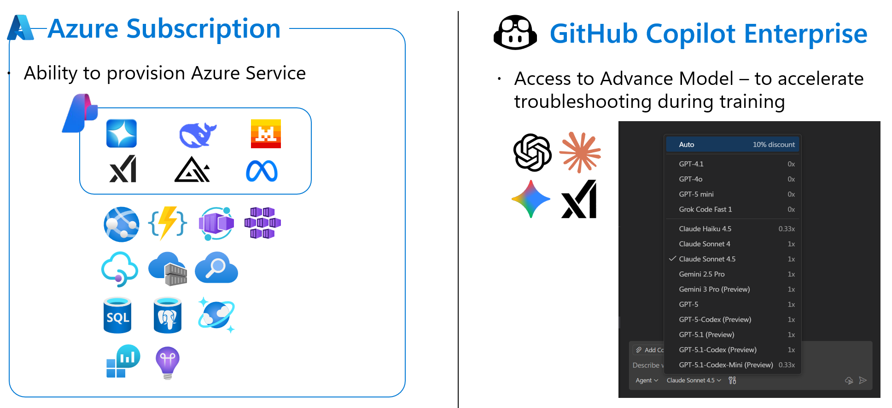
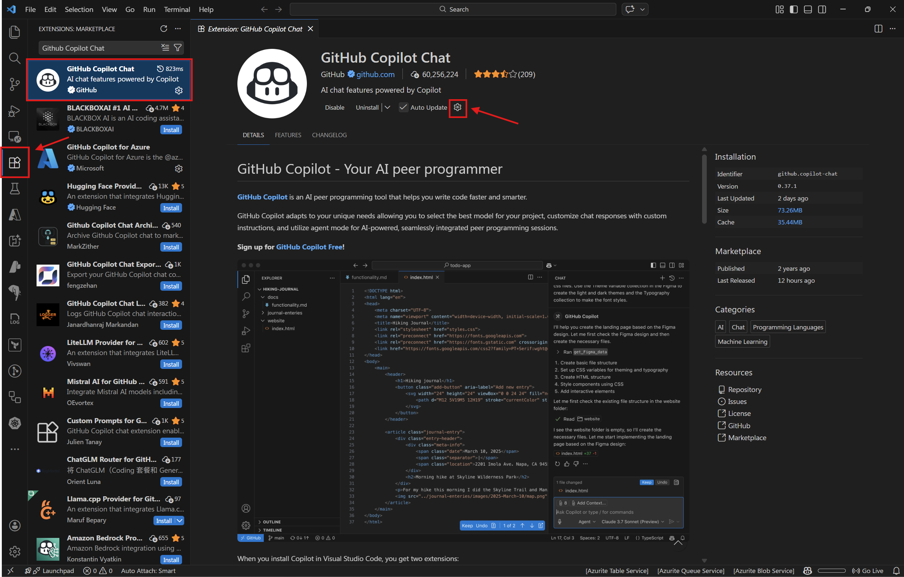
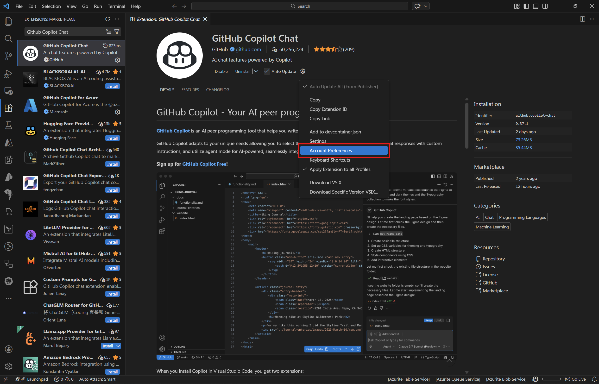
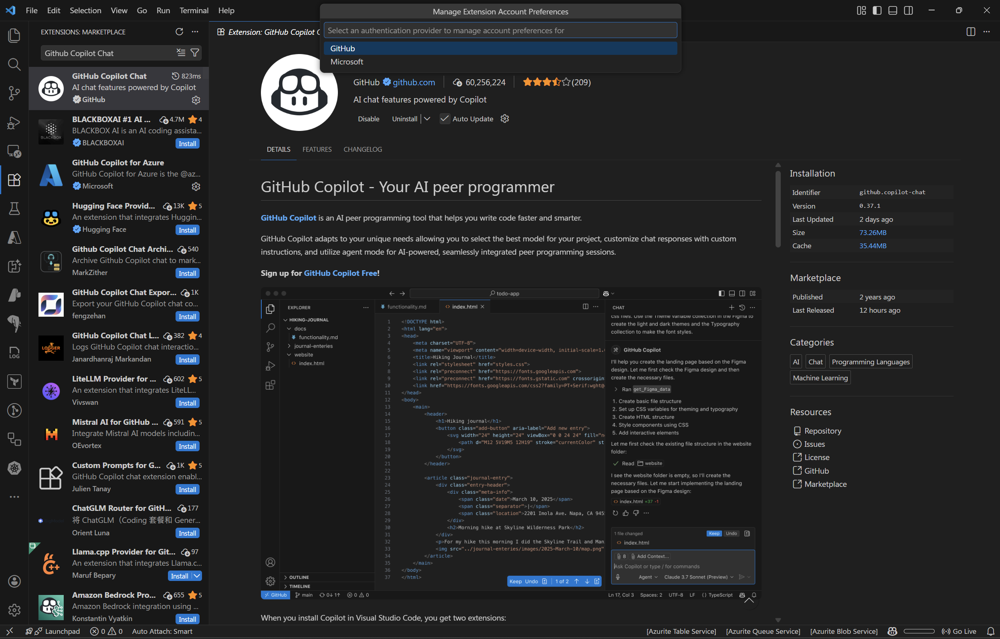
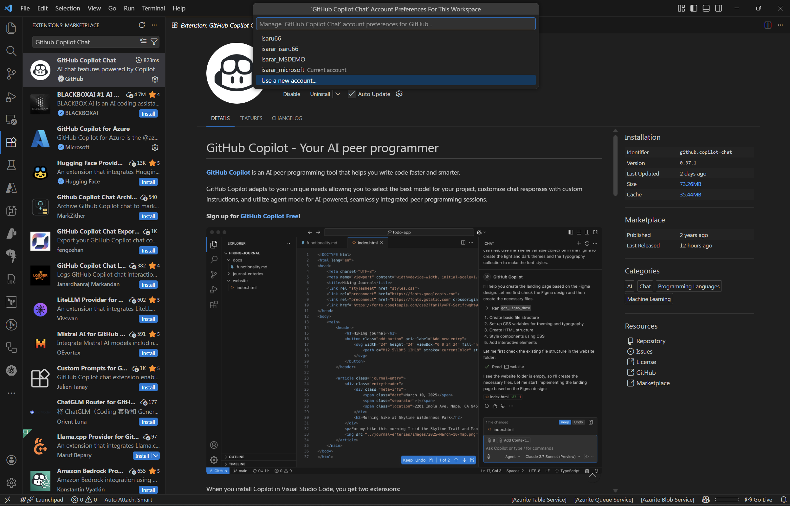
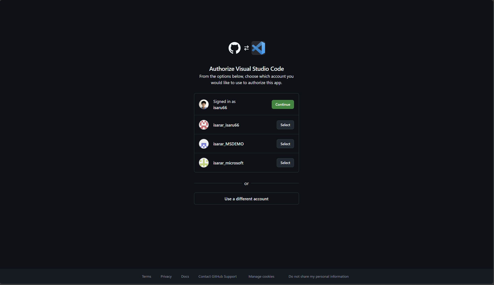
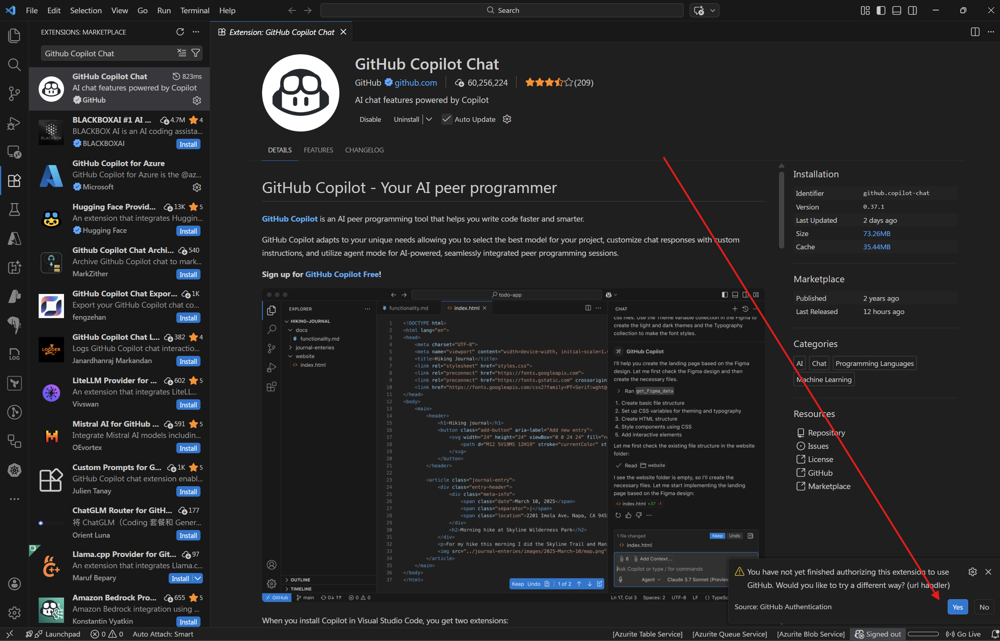
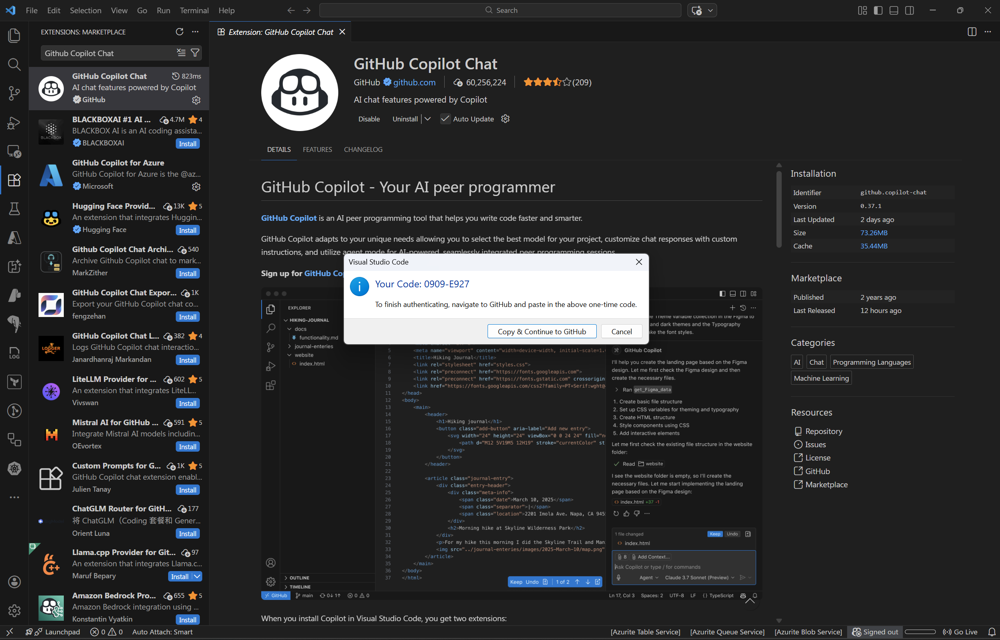
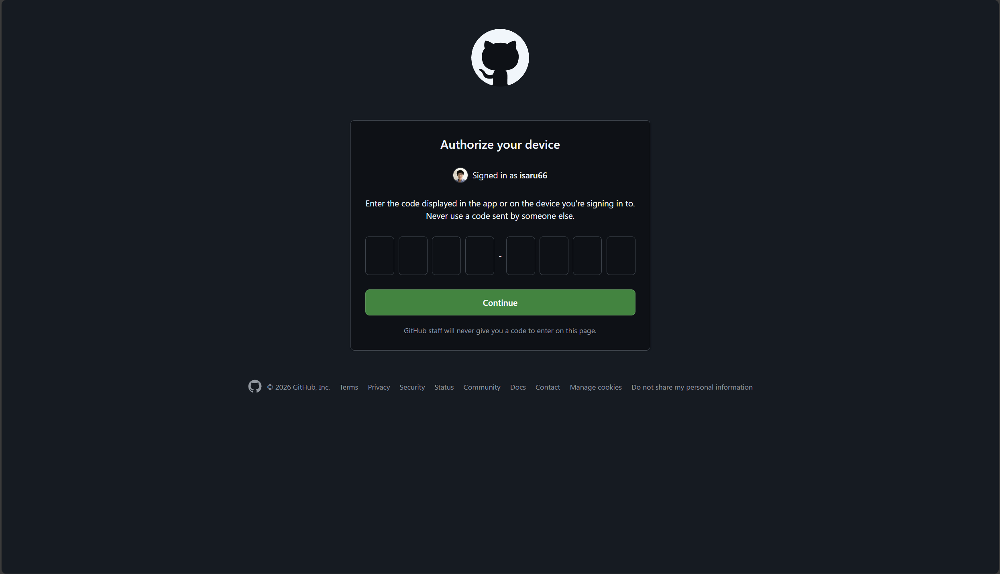

# Task 03 - Microsoft-provided resources for training

## Introduction

For this workshop, Microsoft provides **limited access** to the following resources during the training session. These resources are pre-provisioned and will be available for the duration of the workshop only.

## What Microsoft provides

### Azure Subscription

You will receive access to an **Azure Subscription** that allows you to provision and manage Azure services required for the workshop exercises. This includes resources such as:

- Azure API Management
- Azure Functions
- Azure App Service
- Azure Cosmos DB
- Azure Key Vault
- Azure Monitor / Application Insights
- And other services used throughout the exercises

### GitHub Copilot Enterprise

You will also receive access to **GitHub Copilot Enterprise (GHE)**, which provides access to advanced AI models to accelerate troubleshooting and development during the training. Available models include GPT-4.1, GPT-4o, GPT-5 mini, Claude Sonnet 4.5, Gemini 2.5 Pro, and more.

{: .warning }
> These resources are provided for **training purposes only** and have limited access. Do not use them for personal or production workloads. Access will be revoked after the training session ends.

## Success Criteria

- You have created a dedicated browser profile for the training.
- You are signed in to the Azure portal with the provided training account.
- You are signed in to GitHub Enterprise with SSO authentication.
- You have GitHub Copilot Enterprise activated in VS Code.

## Key Tasks

### 01: Create a dedicated browser profile (Recommended)

To avoid conflicts with your existing personal or work accounts, we strongly recommend creating a separate browser profile in Chrome or Edge dedicated to this training.

<strong>Expand this section to view the solution</strong>

#### For Microsoft Edge

1. Open Microsoft Edge.
2. Click on your **profile icon** in the top-right corner of the browser.
3. Click **Add profile** > **Add**.
4. Choose **Start without your data** and click **Confirm**.
5. A new Edge window will open with a clean profile — use this for all training-related sign-ins.

#### For Google Chrome

1. Open Google Chrome.
2. Click on your **profile icon** in the top-right corner of the browser.
3. Click **Add** (or **Add another account**).
4. Choose **Continue without an account** (or sign in with the training account if applicable).
5. A new Chrome window will open with a clean profile — use this for all training-related sign-ins.

{: .note }
> Using a dedicated browser profile ensures that your training credentials (Azure, GitHub) do not interfere with your personal or corporate accounts. This prevents session conflicts and unexpected sign-out issues.

### 02: Sign in to Azure portal

Sign in to the Azure portal using the credentials provided by the instructor.

<strong>Expand this section to view the solution</strong>

1. Open your **dedicated training browser profile**.
2. Navigate to [https://portal.azure.com](https://portal.azure.com).
3. Enter the **username** and **password** provided by the instructor.
4. Complete multi-factor authentication (MFA) if prompted — you may need the **Microsoft Authenticator** app.
5. Once signed in, verify that you can see the training subscription by navigating to **Subscriptions** in the portal.

{: .note }
> If you are prompted to set up MFA for the first time, follow the on-screen instructions to register the Microsoft Authenticator app with the training account.

### 03: Sign in to GitHub Enterprise (SSO)

GitHub Copilot Enterprise is provided through a GitHub Enterprise (GHE) organization. You must first authenticate via Single Sign-On (SSO) before you can use GitHub Copilot.

<strong>Expand this section to view the solution</strong>

1. Open your **dedicated training browser profile**.
2. Navigate to [https://github.com](https://github.com).
3. Sign in with the **GitHub account** provided by the instructor (or your own GitHub account if you have been added to the GHE organization).
4. After signing in, you need to **authorize SSO** for the training enterprise:
   - Navigate to [https://github.com/enterprises/isaru66-corp/sso](https://github.com/enterprises/isaru66-corp/sso).
   - Click **Authorize** to complete the SSO authentication.
   - You may be redirected to a Microsoft login page — sign in with the **same training credentials** used for Azure.
5. Once SSO is authorized, verify access by navigating to the training organization's page on GitHub.

{: .note }
> SSO authorization is required because GitHub Copilot Enterprise is managed through a GitHub Enterprise organization. Without completing SSO, you will not have access to GitHub Copilot Enterprise features or the advanced AI models.

### 04: Activate GitHub Copilot Enterprise in VS Code

After signing in to GitHub with SSO, configure VS Code to use GitHub Copilot Enterprise.

<strong>Expand this section to view the solution</strong>

1. Open **VS Code**.
2. Go to the **Extensions** view by clicking the Extensions icon in the Activity Bar on the left side (or press **Ctrl+Shift+X**).

3. Search for **GitHub Copilot Chat** in the Extensions Marketplace.
4. Click on **GitHub Copilot Chat** by **GitHub** to open the extension page.
5. Click **Install** if the extension is not already installed.
6. Once installed, click the **gear icon (⚙️)** on the extension page (next to the Disable/Uninstall buttons) and select **Account Preferences**.

Select **GitHub** for authentication provider

Select **Use new account** 

7. Sign in with the **same GitHub account** that has SSO authorization. A browser window will open to complete the sign-in process.

  - if you use seperate browser profile. Go back to VSCode. Then click **Cancel**
  

  - Then click **Yes**.
  

  
  - Then click **Cancel** again, 
  

  - Until VSCode suggest to authenticate with device code. Click **Yes** on device code.
  

  
  - Copy URL, then open this URL in your seperate browser profile that login with training credential
  

  - Enter the device code.
  
8. After signing in, return to VS Code and verify that GitHub Copilot is active:
   - You should see the **Copilot icon** in the status bar at the bottom of VS Code.
   - Open the Copilot Chat panel (**Ctrl+Shift+I** or **Cmd+Shift+I**) and verify you can interact with it.
9. To access advanced models, click on the **model selector** in the Copilot Chat panel and choose from the available models (e.g., Claude Sonnet 4.5, GPT-5.2-Codex, etc.).

