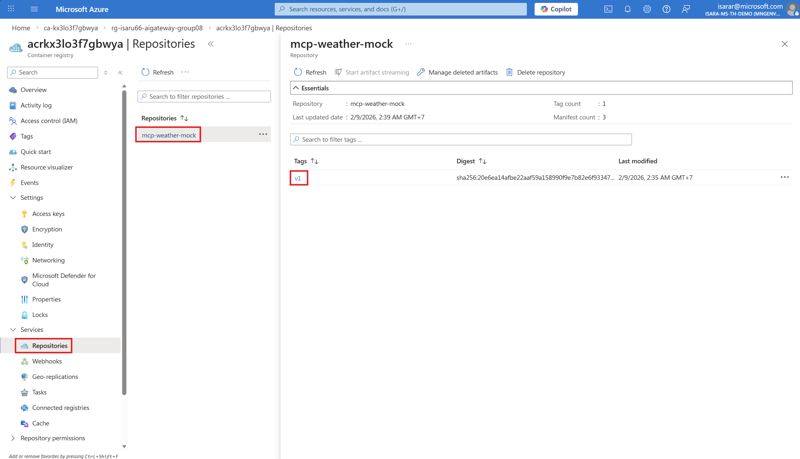
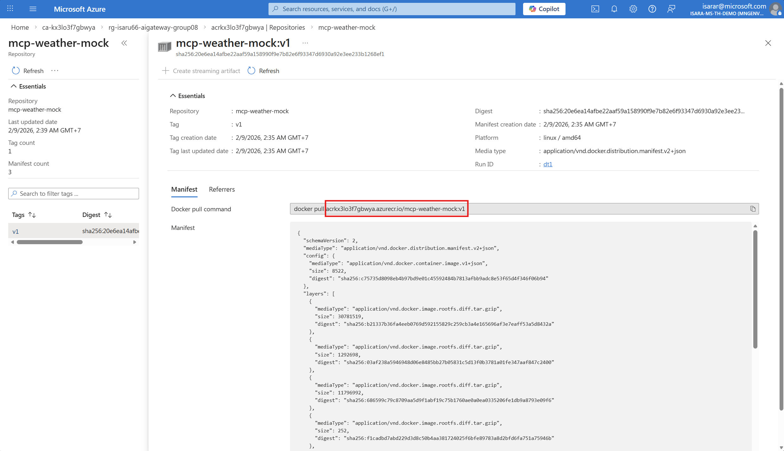
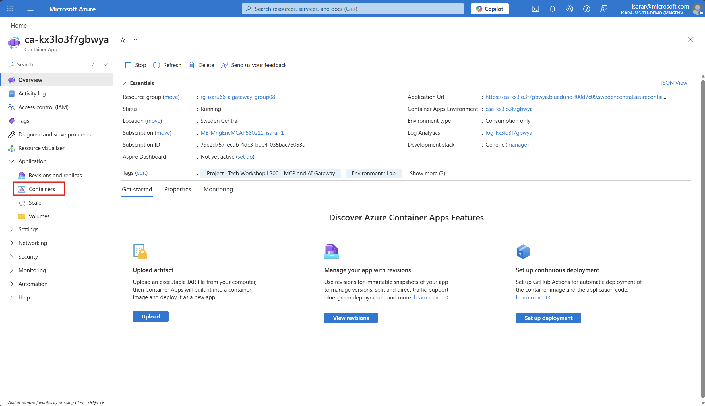
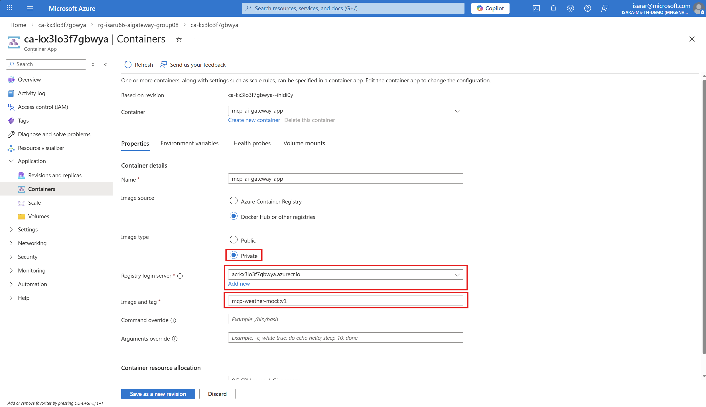
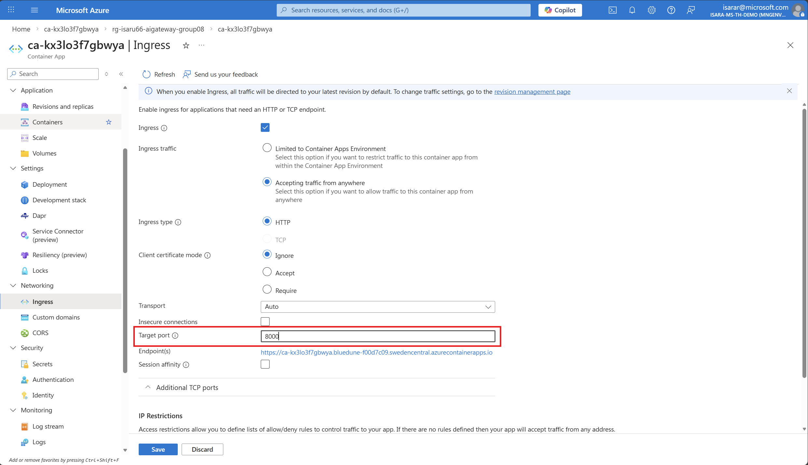

# Task 04 - Build and deploy to Azure Container Apps

## Introduction

Now that you have tested the MCP server locally, it's time to containerize it and deploy it to Azure Container Apps. This will make your MCP server accessible as a cloud-hosted endpoint.

## Description

In this task, you will build a Docker image for the MCP Weather Mock server and deploy it to Azure Container Apps. You have two options for building the image: using Docker Desktop locally or using Azure Container Registry (ACR) build if you don't have Docker installed.

## Success Criteria

- You have built a Docker image for the MCP server.
- The image is pushed to Azure Container Registry.
- The MCP server is deployed and running on Azure Container Apps.
- You can access the MCP endpoint via the Container App URL.

## Learning Resources

- [Azure Container Apps overview](https://learn.microsoft.com/azure/container-apps/overview)
- [Azure Container Registry](https://learn.microsoft.com/azure/container-registry/container-registry-intro)
- [Build container images in Azure Container Registry](https://learn.microsoft.com/azure/container-registry/container-registry-tutorial-quick-task)

## Key Tasks

### 01: Set up environment variables

Define the environment variables needed for the deployment using values from your Azure Developer CLI deployment.

<details markdown="block">
<summary><strong>Expand this section to view the solution</strong></summary>

Since you deployed resources using `azd up`, retrieve the environment variables from Azure Developer CLI:

**Linux / macOS / Codespace (Bash):**

```bash
# Load all azd environment variables
eval $(azd env get-values)

# Set additional variables for this deployment
CONTAINER_APP_NAME="mcp-weather-mock"
IMAGE_NAME="mcp-weather-mock"
IMAGE_TAG="v1"

# Assign azd outputs to simplified variable names
RESOURCE_GROUP=$AZURE_RESOURCE_GROUP
ACR_NAME=$container_registry_name
CONTAINER_APP_ENV=$container_app_environment_name
```

**Windows (PowerShell):**

```powershell
# Load all azd environment variables
azd env get-values | ForEach-Object {
    if ($_ -match '^([^=]+)=(.*)$') {
        Set-Variable -Name $matches[1] -Value $matches[2]
    }
}

# Set additional variables for this deployment
$CONTAINER_APP_NAME="mcp-weather-mock"
$IMAGE_NAME="mcp-weather-mock"
$IMAGE_TAG="v1"

# Assign azd outputs to simplified variable names
$RESOURCE_GROUP=$AZURE_RESOURCE_GROUP
$ACR_NAME=$container_registry_name
$CONTAINER_APP_ENV=$container_app_environment_name
```

{: .note }
> The `azd env get-values` command retrieves all environment variables set during your `azd up` deployment, including Azure resource names, subscription details, and deployment outputs from your Bicep template.

</details>

### 02: Build the Docker image

You have two options for building the Docker image. Choose the option that fits your environment.

#### Option A: Build locally with Docker Desktop

Use this option if you have Docker Desktop or Rancher Desktop installed and running.

{: .warning }
> If you are using a GitHub Codespace, there is no docker install. Please use Option B.


<details markdown="block">
<summary><strong>Expand this section to view the solution</strong></summary>

Navigate to the MCP Weather Mock server directory and build the image:

```bash
cd src/01-mcp-weather-mock
```

**Linux / macOS / Codespace:**

```bash
docker build -t $ACR_NAME.azurecr.io/$IMAGE_NAME:$IMAGE_TAG .
```

**Windows (PowerShell):**

```powershell
docker build -t "$ACR_NAME.azurecr.io/$IMAGE_NAME`:$IMAGE_TAG" .
```

Verify the image was built successfully:

```bash
docker images | grep mcp-weather-mock
```

</details>

#### Option B: Build using Azure Container Registry (ACR)

Use this option if you **do not have Docker Desktop installed**. ACR can build Docker images directly in the cloud.

<details markdown="block">
<summary><strong>Expand this section to view the solution</strong></summary>

Navigate to the MCP Weather Mock server directory:

```bash
cd src/01-mcp-weather-mock
```

Use the `az acr build` command to build the image directly in ACR. This sends the source code to Azure and builds the image in the cloud — no local Docker installation required.

**Linux / macOS / Codespace:**

```bash
az acr build \
  --registry $ACR_NAME \
  --resource-group $RESOURCE_GROUP \
  --image $IMAGE_NAME:$IMAGE_TAG \
  .
```

**Windows (PowerShell):**

```powershell
az acr build `
  --registry $ACR_NAME `
  --resource-group $RESOURCE_GROUP `
  --image "${IMAGE_NAME}:${IMAGE_TAG}" `
  .
```

This command will:
1. Upload the source code to ACR.
2. Build the Docker image using the `dockerfile` in the current directory.
3. Push the built image to the ACR repository.

You should see build logs streaming in the terminal, ending with a success message.

{: .note }
> The `az acr build` command is ideal for CI/CD scenarios or when Docker is not available locally. It uses ACR Tasks to build the image in Azure.

</details>

### 03: Push the image to ACR (Local build only)

If you built the image locally (Option A), you need to push it to Azure Container Registry.

<details markdown="block">
<summary><strong>Expand this section to view the solution</strong></summary>

{: .note }
> If you used **Option B** (ACR build) in the previous step, **skip this step** — the image was already pushed to ACR as part of the build process.

First, log in to your Azure Container Registry:

```bash
az acr login --name $ACR_NAME
```

Then push the image:

**Linux / macOS / Codespace:**

```bash
docker push $ACR_NAME.azurecr.io/$IMAGE_NAME:$IMAGE_TAG
```

**Windows (PowerShell):**

```powershell
docker push "$ACR_NAME.azurecr.io/$IMAGE_NAME`:$IMAGE_TAG"
```

Verify the image is in ACR:

**In Azure Portal**

Go to Azure Portal, Search Azure Container Registry.
Then Open **Repository** menu. Find Your image and tag


after click on tag, you will see Docker Image URL here


**Linux / macOS / Codespace:**
```bash
az acr repository list --name $ACR_NAME --output table
```

You should see `mcp-weather-mock` in the list.

{: .note }
> Save this image URL — you'll need it in the next step when deploying to Azure Container Apps.

</details>

### 04: Deploy to Azure Container Apps

Create a Container App from the image in ACR.

<details markdown="block">
<summary><strong>Expand this section to view the solution</strong></summary>

You have two options for Deploy the container app.
Choose the option that fits your environment.

#### Option A: In Azure Portal

Go to Azure Container App. Then click on **Containers** menu


In the Container configuration:
1. Select **Private** as the Image type
2. Set **Registry login server** to your ACR name (e.g., `acrkx3lo3f7gbwya.azurecr.io`)
3. Set **Image and tag** to your image path, exclude ACR name (e.g., `mcp-weather-mock:v1`)



CLick **Save as a new revision**

Go to **Ingress** settings and configure:
1. Enable **Ingress** checkbox
2. Set **Ingress traffic** to **Accepting traffic from anywhere**
3. Set **Ingress type** to **HTTP**
4. Set **Target port** to `8000`



Click **Save** to save the change

#### Option B: Use Azure CLI

**Linux / macOS / Codespace:**

```bash
az containerapp create \
  --name $CONTAINER_APP_NAME \
  --resource-group $RESOURCE_GROUP \
  --environment $CONTAINER_APP_ENV \
  --image $ACR_NAME.azurecr.io/$IMAGE_NAME:$IMAGE_TAG \
  --registry-server $ACR_NAME.azurecr.io \
  --target-port 8000 \
  --ingress external \
  --min-replicas 0 \
  --max-replicas 3
```

**Windows (PowerShell):**

```powershell
az containerapp create `
  --name $CONTAINER_APP_NAME `
  --resource-group $RESOURCE_GROUP `
  --environment $CONTAINER_APP_ENV `
  --image "$ACR_NAME.azurecr.io/$IMAGE_NAME`:$IMAGE_TAG" `
  --registry-server "$ACR_NAME.azurecr.io" `
  --target-port 8000 `
  --ingress external `
  --min-replicas 0 `
  --max-replicas 3
```

After the deployment completes, get the application URL:

#### Option A: In Azure Portal

your application url is here


#### Option B: Use Azure CLI

**Linux / macOS / Codespace:**

```bash
az containerapp show \
  --name $CONTAINER_APP_NAME \
  --resource-group $RESOURCE_GROUP \
  --query "properties.configuration.ingress.fqdn" \
  --output tsv
```

**Windows (PowerShell):**

```powershell
az containerapp show `
  --name $CONTAINER_APP_NAME `
  --resource-group $RESOURCE_GROUP `
  --query "properties.configuration.ingress.fqdn" `
  --output tsv
```

The output will be a URL like `mcp-weather-mock.<region>.azurecontainerapps.io`.

</details>

### 05: Verify the deployment

Test the deployed MCP server to ensure it is working correctly.

<details markdown="block">
<summary><strong>Expand this section to view the solution</strong></summary>

Using the URL from the previous step, test the MCP endpoint. You can use `curl`, the REST Client extension, or a browser.

**Quick test with curl:**

```bash
curl -X POST https://<your-container-app-url>/mcp \
  -H "Content-Type: application/json" \
  -H "Accept: application/json, text/event-stream" \
  -d '{
    "jsonrpc": "2.0",
    "id": 1,
    "method": "initialize",
    "params": {
      "protocolVersion": "2024-11-05",
      "capabilities": {},
      "clientInfo": {
        "name": "test-client",
        "version": "1.0.0"
      }
    }
  }'
```

**Test with the `.http` file:**

You can also update the `@baseUrl` variable in `src/01-mcp-weather-mock/test/test.http` to point to your deployed Container App:

```http
@baseUrl = https://<your-container-app-url>
```

Then re-run the same requests from Task 03 to verify the deployed server.

{: .note }
> The deployed MCP server URL is your cloud-hosted MCP endpoint. You will use this URL in later exercises when configuring Azure API Management as an AI Gateway to route MCP traffic.

</details>
