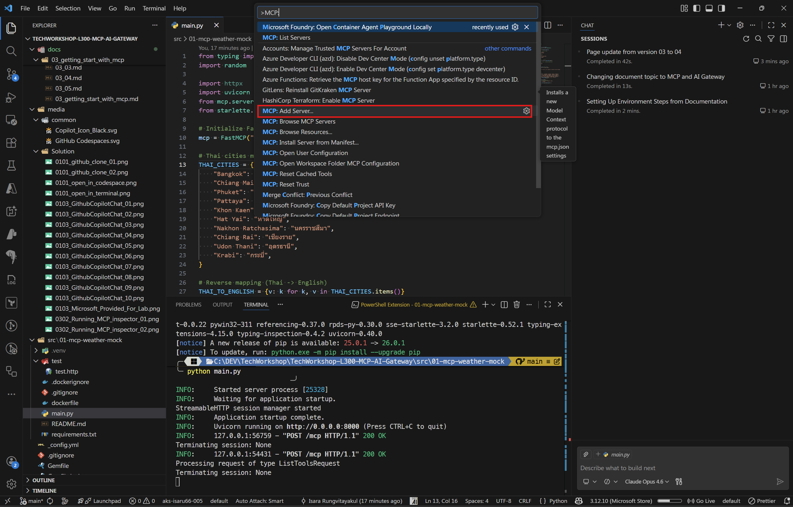
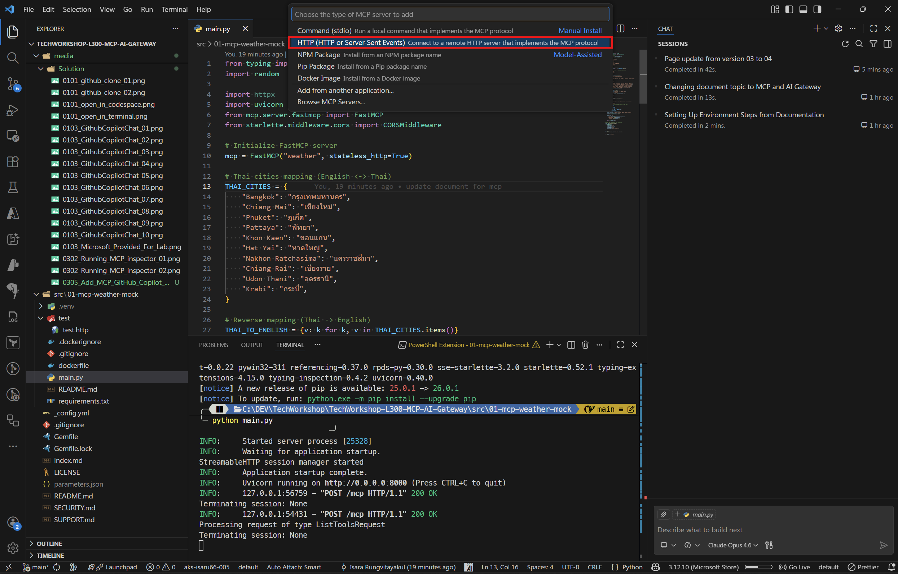
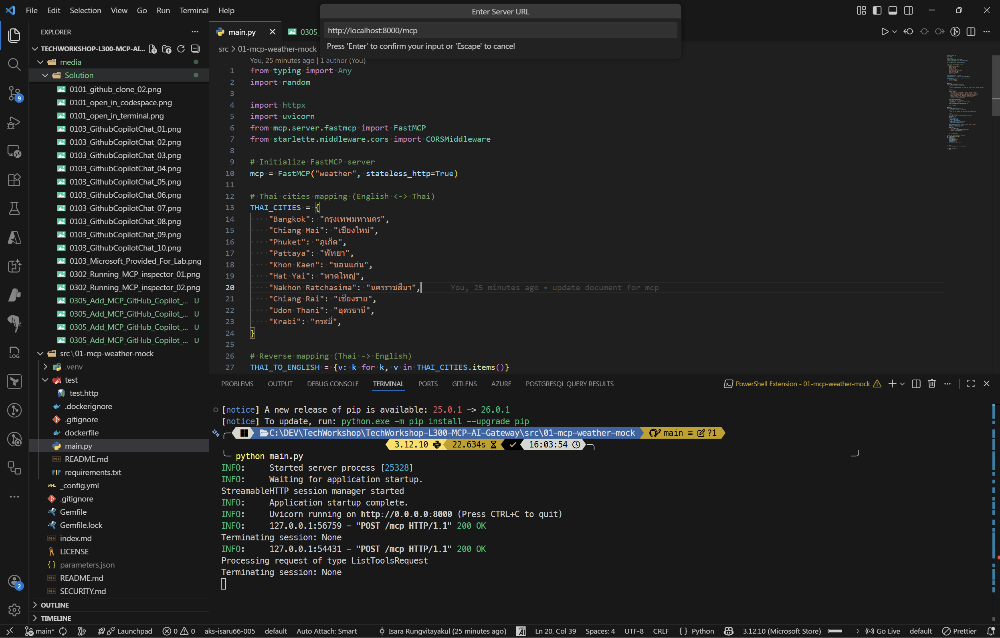
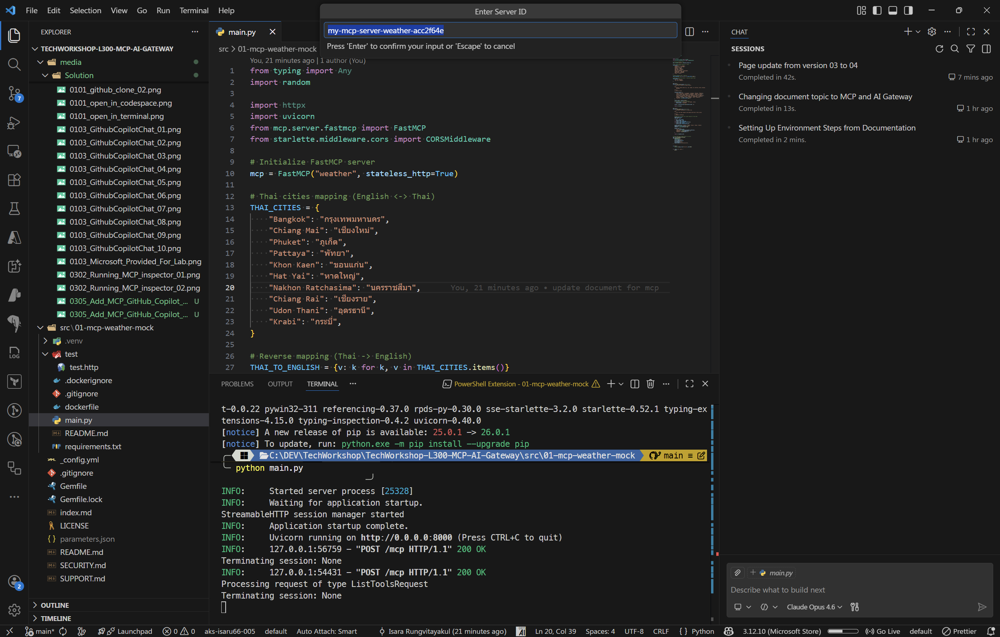
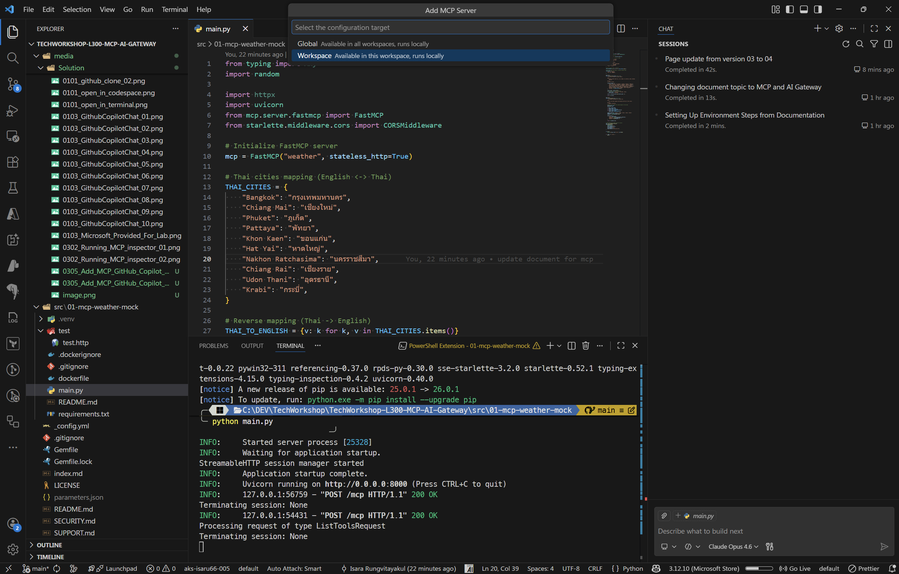
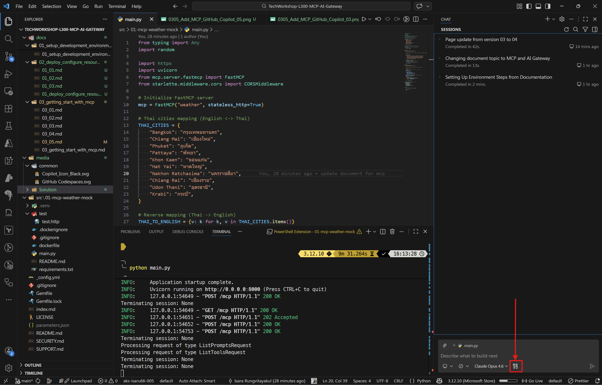
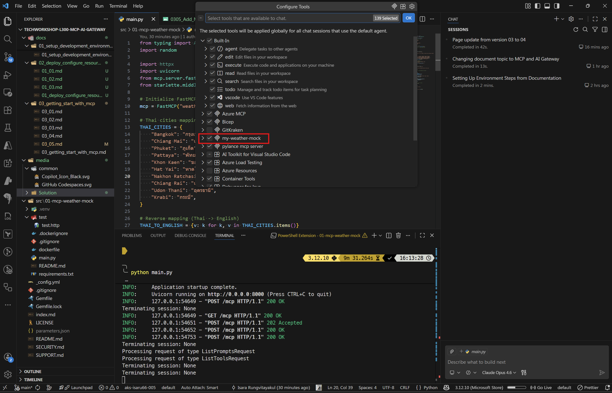
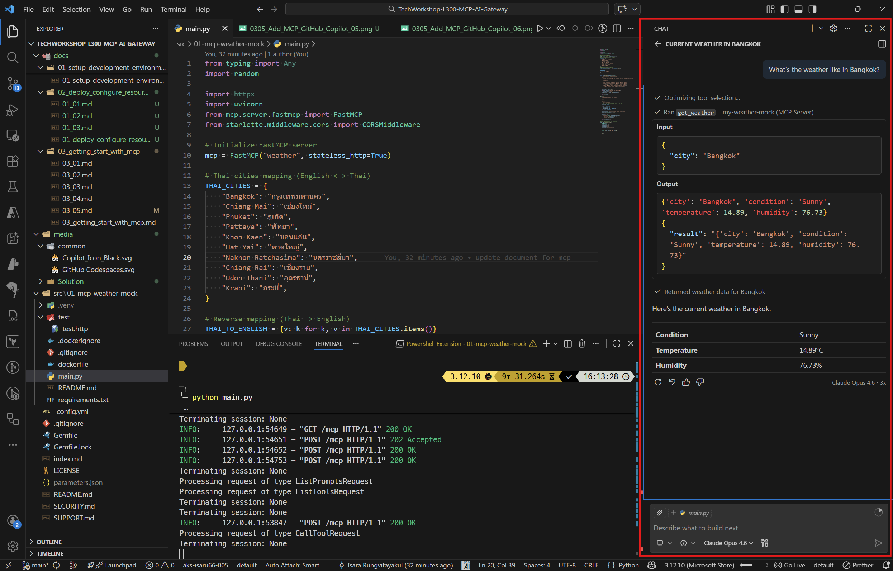

# Task 05 - Test MCP server with GitHub Copilot

## Introduction

Now that your MCP server is running (either locally or deployed to Azure Container Apps), you can connect it to GitHub Copilot in VS Code. This allows Copilot's agent mode to use the MCP tools directly from the chat interface — meaning you can ask natural language questions and Copilot will automatically call the appropriate MCP tools to get the answers.

## Description

In this task, you will configure VS Code to register your MCP server as a tool source for GitHub Copilot. You will then use Copilot Chat in agent mode to interact with the `get_cities` and `get_weather` tools using natural language.

## Success Criteria

- The MCP server is registered in VS Code settings.
- GitHub Copilot can discover and list the MCP tools.
- You can ask Copilot natural language questions and it calls the MCP tools automatically.

## Learning Resources

- [Use MCP servers in VS Code](https://code.visualstudio.com/docs/copilot/chat/mcp-servers)
- [GitHub Copilot agent mode](https://code.visualstudio.com/docs/copilot/chat/chat-agent-mode)

## Key Tasks

### 01: Register the MCP server in VS Code

Add the MCP server configuration to your VS Code settings so GitHub Copilot can discover it.

<details markdown="block">
<summary><strong>Expand this section to view the solution</strong></summary>

1. Open the **Command Palette** in VS Code (**Ctrl+Shift+P** or **Cmd+Shift+P**).
2. Type **MCP: Add Server** and select it.

3. Select **HTTP (HTTP or Server Send Event)** as the server type.

4. Enter the MCP server URL:
   - **Local server:** `http://localhost:8000/mcp`
   - **Azure Container Apps:** `https://<your-container-app-url>/mcp`

5. Enter a name for the server, e.g., `my-weather-mock`.

6. Select **Workspace Settings** to save the configuration to the current workspace.

This creates (or updates) a `.vscode/mcp.json` file in your workspace with the following content:

```json
{
  "servers": {
    "weather-mock": {
      "type": "http",
      "url": "http://localhost:8000/mcp"
    }
  }
}
```

{: .note }
> You can also manually create or edit the `.vscode/mcp.json` file directly if you prefer.

</details>

### 02: Verify the MCP server connection

Confirm that VS Code has successfully connected to the MCP server and can discover the tools.

<details markdown="block">
<summary><strong>Expand this section to view the solution</strong></summary>

1. After adding the server, VS Code will attempt to connect automatically.
2. Open the **Command Palette** (**Ctrl+Shift+P**) and type **MCP: List Servers** to see the registered servers.
3. The `my-weather-mock` server should show a **Running** status.
4. If the server shows as disconnected, ensure the MCP server is running and click **Restart** from the server list.

You can also check the connection by opening Copilot Chat and looking for the **tools icon** (wrench/hammer icon) — clicking it should show the MCP tools (`get_cities`, `get_weather`) in the available tools list.

You should see your MCP server here


</details>

### 03: Test with GitHub Copilot in agent mode

Use GitHub Copilot Chat to interact with the MCP tools using natural language.

<details markdown="block">
<summary><strong>Expand this section to view the solution</strong></summary>

1. Open **Copilot Chat** (**Ctrl+Shift+I** or **Cmd+Shift+I**).
2. Make sure you are in **Agent** mode (check the mode selector at the bottom of the chat panel — it should say **Agent**, not **Chat** or **Edit**).
3. Try asking the following questions:

**Example 1: Get cities**

```
What cities are available in Thailand?
```

Copilot will automatically call the `get_cities` tool with `country: "thailand"` and return the list of cities.

**Example 2: Get weather**

```
What's the weather like in Bangkok?
```

Copilot will call the `get_weather` tool with `city: "Bangkok"` and present the weather information in a readable format.




**Example 3: Multi-step query**

```
Get me the list of cities in the USA and then check the weather for New York.
```

Copilot will chain multiple tool calls — first calling `get_cities` for the USA, then calling `get_weather` for New York.

{: .note }
> When Copilot wants to call an MCP tool, it will show a confirmation prompt asking you to **Allow** or **Deny** the tool call. Click **Allow** (or **Always Allow** for the session) to let Copilot execute the tool.

{: .note }
> The weather data is randomly generated by the mock server, so values will vary with each request.

</details>

### 04: Remove the mock MCP server (Optional cleanup)

Once you've finished testing with the mock MCP server, you may want to remove it from your VS Code configuration.

<details markdown="block">
<summary><strong>Expand this section to view the solution</strong></summary>

1. Open the **Command Palette** in VS Code (**Ctrl+Shift+P** or **Cmd+Shift+P**).
2. Type **Preferences: Open Workspace Settings (JSON)** and select it.
3. Locate the `.vscode/mcp.json` file in your workspace or find the MCP server configuration in your settings.
4. Remove the mock MCP server entry from the `servers` object.

For example, if your `.vscode/mcp.json` looks like this:

```json
{
  "servers": {
    "my-weather-mock": {
      "type": "http",
      "url": "http://localhost:8000/mcp"
    }
  }
}
```

Delete the `"my-weather-mock"` entry or the entire file if it's no longer needed.

Alternatively, you can:
1. Open the **Command Palette** and type **MCP: List Servers**.
2. Find your mock server in the list.
3. Click the **Remove** or **Delete** button next to the server name.

After removal, the MCP tools from this server will no longer appear in GitHub Copilot's available tools list.

</details>
