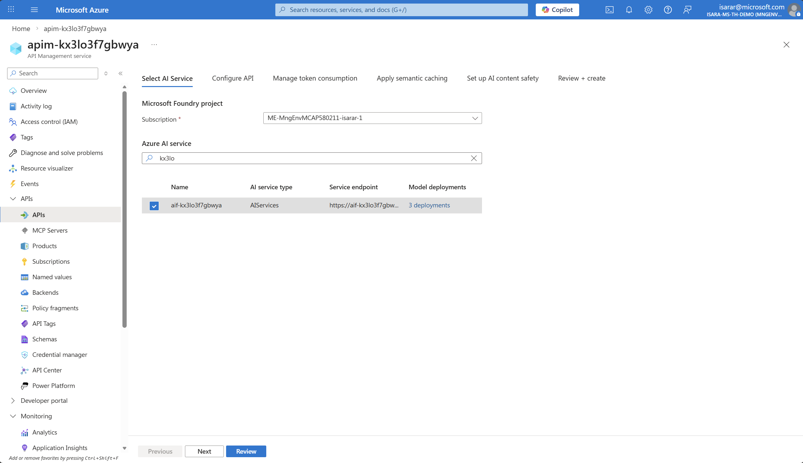
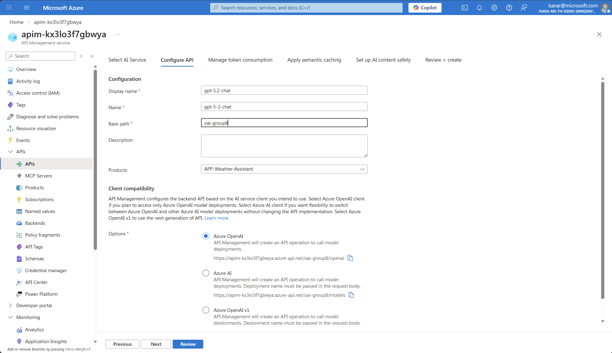
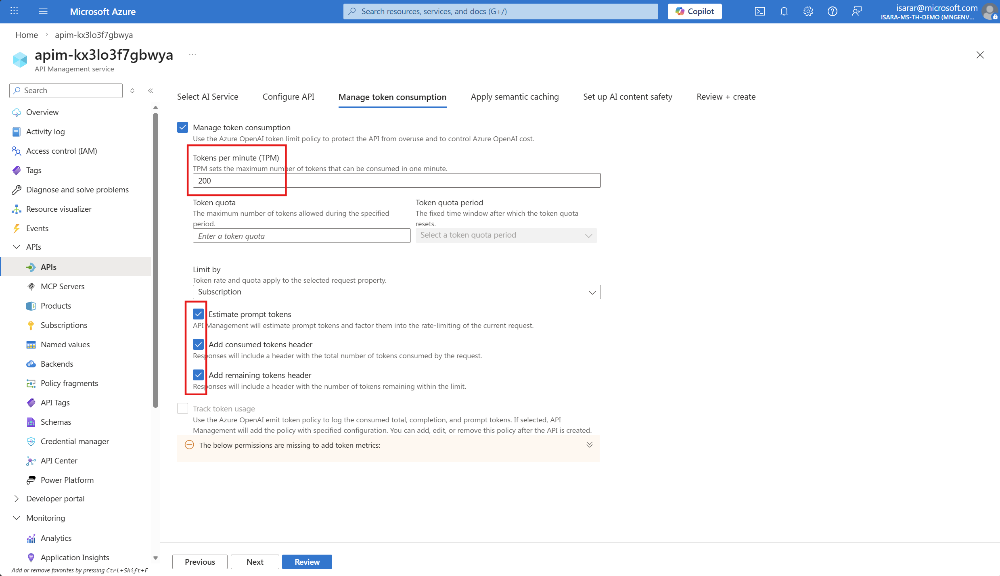
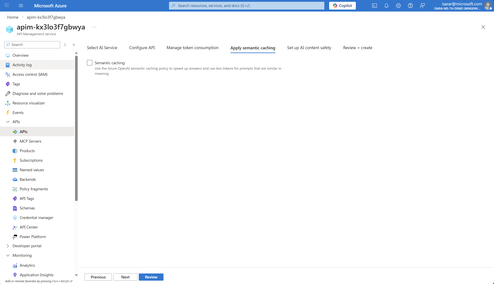
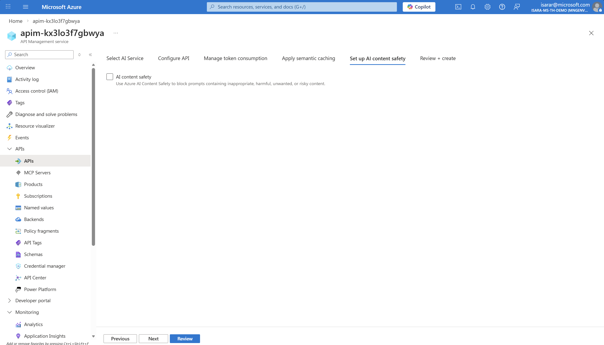
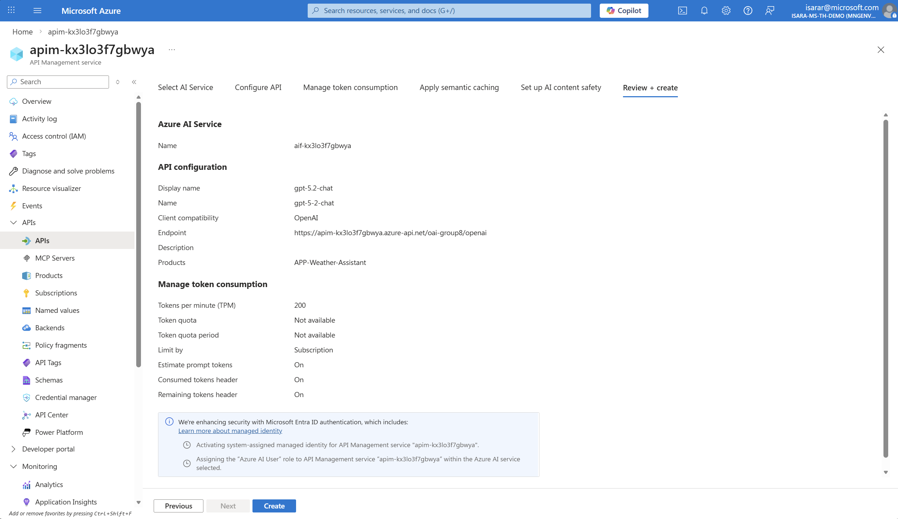
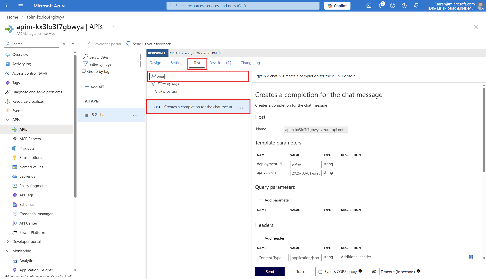
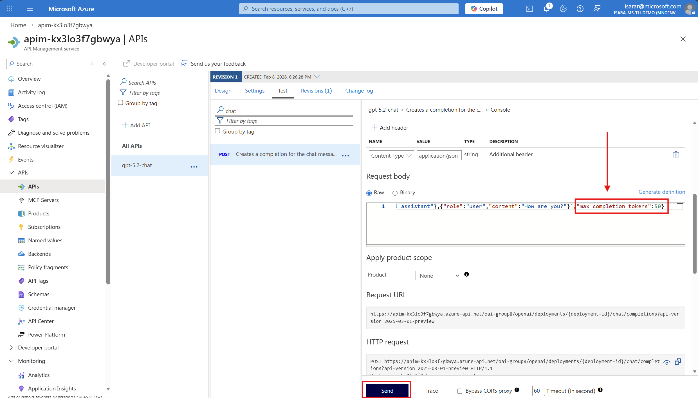
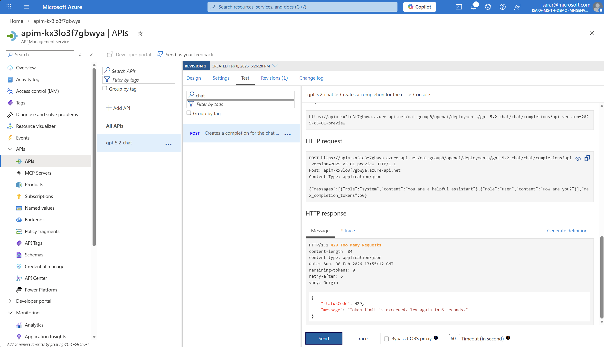

# Task 02 - Control cost and performance with rate limiting

## Introduction

Once you bring an LLM to production and expose it as an API Endpoint, you need to consider how you manage such an API. In this task, you will learn how to control token consumption using Azure API Management rate limiting policies to manage costs and ensure fair usage across your applications.

## Description

In this task, you will add an API in Azure API Management that points to your model deployed in Azure Foundry. You will then configure rate limiting policies to control token consumption, which is important for managing costs and ensuring a fair distribution of resources. By implementing token quotas and limits, you can prevent excessive usage while maintaining a good user experience.

## Success Criteria

- You have imported your Azure Foundry model as an API in Azure API Management.
- You have configured a rate limiting policy to control token consumption.
- You have tested the rate limiting behavior and observed a 429 error when limits are exceeded.

## Learning Resources

- [What is Microsoft Foundry?](https://learn.microsoft.com/azure/ai-foundry/what-is-azure-ai-foundry)
- [Azure OpenAI token limit policy](https://learn.microsoft.com/azure/api-management/azure-openai-token-limit-policy)
- [API Management policies overview](https://learn.microsoft.com/azure/api-management/api-management-howto-policies)

## Key Tasks

### 01: Import Azure Foundry model as API and configure rate limiting policy

To control token consumption and manage your AI model deployment, you need to import your Azure Foundry model as an API in Azure API Management and configure a rate limiting policy. This will allow you to control costs and ensure fair usage across your applications.

<details markdown="block">
<summary><strong>Expand this section to view the solution</strong></summary>

#### Step 1: Import Azure OpenAI Service as API

Navigate to the [Azure Portal](https://portal.azure.com/) and open the Azure API Management instance that you deployed in the first task.

In the Azure API Management resource, select **APIs** from the left-hand navigation menu under the **APIs** section.


In the APIs page, click **+ Add API** button. From the available API types gallery, select **Microsoft Foundry** to import your Azure Foundry Model service as an API.


The **API import from Microsoft Foundry Project** dialog will appear. Configure the following settings:

1. **Subscription**: Select your Azure subscription from the dropdown

2. **Azure Foundry Model Service**: Choose the Azure Foundry model that is associated with your Microsoft Foundry project

{: .note }
> Select the Azure Foundry model service that uses the similar name suffix as your API Management instance.

3. Click **Next**
3. **Display name**: Provide a descriptive name for your API (e.g., "gpt-5.2-chat")
4. **Name**: This will be auto-populated based on the display name

5. **BasePath**: oai-group10 , replace with your group name
5. **Description**: Optionally provide a description for documentation purposes
6. Click **Next** to configure Rate limit
7. You will be in **Manage token Consumption** page

Adjust **Token per minutes (TPM)** to 200.

Check on the following
- Estimate prompt tokens
- Add consumed token header
- Add remaining token header



8. Click **Next**

Don't need config anything for semantic caching.


9. Click **Next**

Don't need config anything for content safety for now.


10. Click **Next**



11. Click **Create** to import the API

The API will be created and you'll see the API overview page showing all the imported operations from your Azure OpenAI service.

{: .note }
> When you import the Azure OpenAI API, the following is automatically configured for you:
> - **Managed identity authentication** is set up as the security mechanism, making all calls more secure with identity management handled by Azure
> - A **backend** is created pointing to your Azure Foundry endpoint URL

</details>

### 02: Test rate limiting behavior

With the rate limiting policy configured, you should test it to ensure it works as expected. You will make multiple consecutive requests to exceed the token limit and observe the 429 (Too Many Requests) error response.

<details markdown="block">
<summary><strong>Expand this section to view the solution</strong></summary>

In the Azure API Management instance, navigate to your API and select the **Test** tab from the top navigation menu.



From the list of available operations, select **Chat Completions - Creates a completion for the chat message** or a similar POST operation.


In **Template Paramters**, input deployment-id as **gpt-5.2-chat**


The test interface will display. Scroll down to the **Request body** section and replace the default content with the following JSON payload:

```json
{
  "messages": [
    {
      "role": "system",
      "content": "you are a friendly assistant"
    },
    {
      "role": "user",
      "content": "how is the weather in Bangkok?"
    }
  ]
}
```



If you calling GPT-5.2, in request body, change from max_token -> max_completion_token ( this due to GPT-5 API specification change)

Scroll down and click the **Send** button. Then click **Send** multiple times in quick succession (4-5 times) to make several requests and consume tokens rapidly.

Initially, you'll receive successful responses showing the AI model's completion response with a **200 OK** status code.

After exhausting the allowed tokens-per-minute quota (200 tokens), subsequent requests will receive a **429 Too Many Requests** error response. This indicates that the rate limiting policy is working correctly and protecting your resources.



The 429 error response will include headers showing:

- How many tokens you have consumed
- When the limit will reset
- The remaining tokens available

{: .note }
> If you wait for a minute, the token counter will reset and you will be able to make requests again.

</details>

## Conclusion

You have successfully configured token-based rate limiting using Azure API Management, which is essential for cost control when working with AI models. By implementing the `azure-openai-token-limit` policy, you can:

- **Control costs**: Prevent unexpected charges by limiting token consumption per minute
- **Ensure fair usage**: Distribute resources equitably across different applications or consumers
- **Protect resources**: Prevent a single consumer from exhausting your Azure OpenAI quotas
- **Improve predictability**: Make your application's costs more predictable and manageable

This rate limiting approach gives you fine-grained control over how your AI services are consumed, allowing you to align usage with your budget and business requirements. In production environments, you can adjust the token limits based on your application's needs, implement different limits for different subscription tiers, and use counter keys to track usage by various dimensions such as subscription, user, or application.

