# Exercise 05 - Track AI Consumption with Azure Monitoring

## Introduction

Monitoring your AI consumption is critical for managing costs and ensuring fair resource allocation across your applications. By tracking token usage through Azure API Management policies and Application Insights, you gain visibility into how your AI services are being consumed, enabling you to make informed decisions about optimization and cost management.

## Description

In this exercise, you will configure monitoring policies in Azure API Management to track token consumption for your Azure OpenAI endpoints. You will enable Application Insights integration, configure token tracking dimensions, and test the monitoring setup by viewing real-time metrics in the Azure portal.

## Success Criteria

- You have enabled monitoring policies on your Azure OpenAI API in API Management.
- You have configured token tracking dimensions (prompt tokens, completion tokens, total tokens).
- You have successfully tested the API and viewed token consumption metrics in Application Insights.

## Learning Resources

- [Emit token metric policy](https://learn.microsoft.com/azure/api-management/azure-openai-emit-token-metric-policy)
- [Set up Azure Monitor](https://learn.microsoft.com/azure/api-management/api-management-howto-use-azure-monitor)
- [Import Azure OpenAI API to API Management](https://learn.microsoft.com/azure/api-management/azure-openai-api-from-specification)

## Key Tasks

### 01: Enable monitoring on the Azure OpenAI API

Now that you have imported your Azure OpenAI instance into API Management (from the previous exercise), you need to enable monitoring to track token consumption.

<details markdown="block">
<summary><strong>Expand this section to view the solution</strong></summary>

1. Navigate to the [Azure portal](https://portal.azure.com/) and open your API Management instance.
1. In the left menu, under **APIs**, select **APIs**.
1. Select your Azure OpenAI API (e.g., **gpt-5.2-chat** or the name you used during import).
1. Select the **Settings** tab.
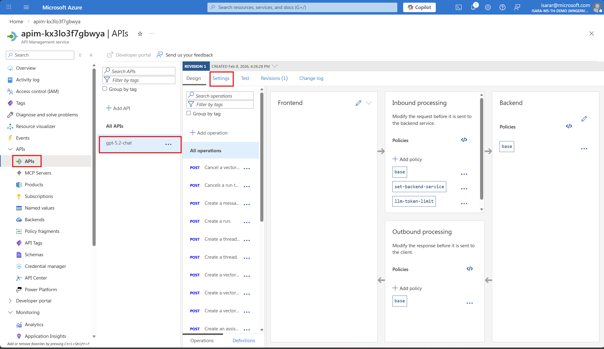
1. Scroll down to the **Application Insights** section.
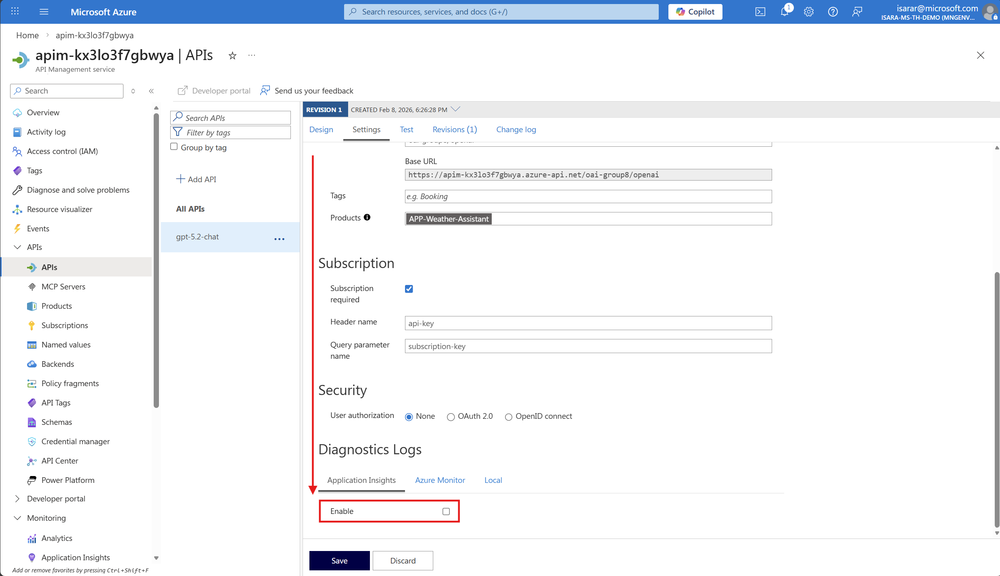
1. Check the **Enable** checkbox to enable Application Insights integration.

1. Select your Application Insights instance from the dropdown (it should have been created during the deployment).
click on **Manage**
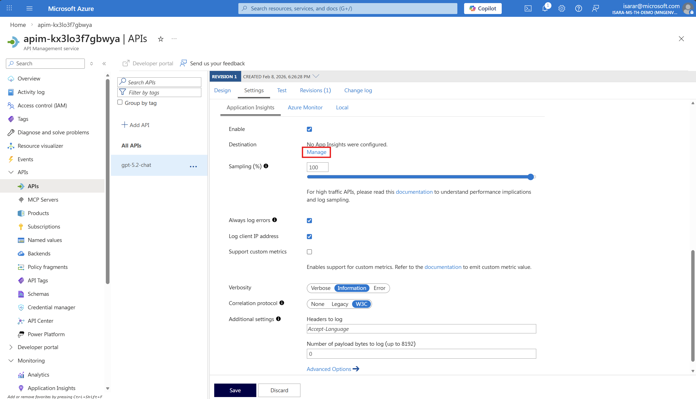
CLick **Add**
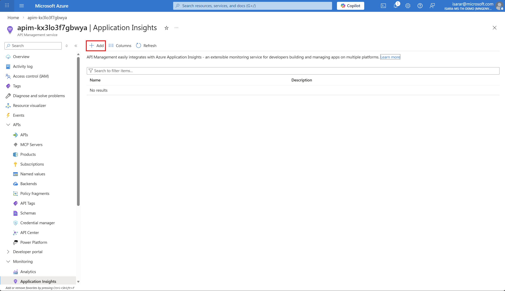
1. Leave other settings as default.
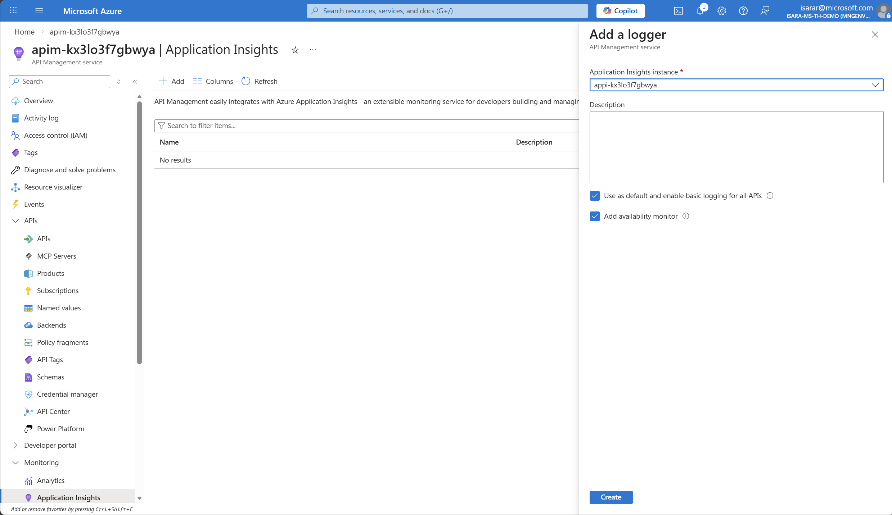
1. Select **Create** to create logger the changes.
1. Go back to API page. Add Application Insight in **Destination**
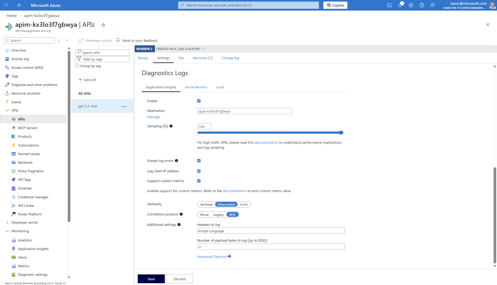
1. On Correlation protocol, select **W3C**
1. Click **Save** to save the change
1. Go back to API page. then Go to **Azure Monitor** tab
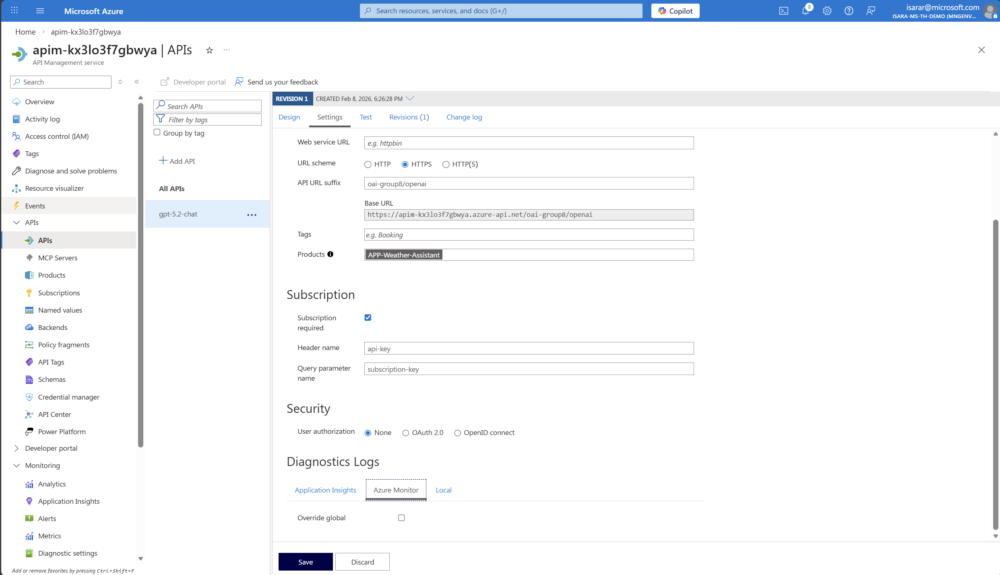
1. Click on **Override global**, then enable **Log LLM message**
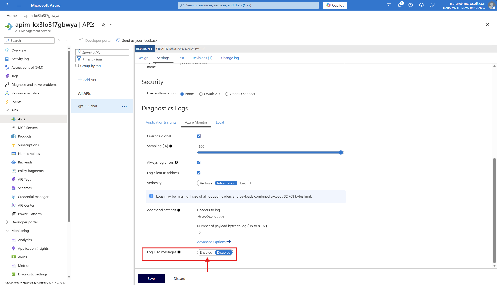
1. Click on **Override global**, then enable **Log LLM message**
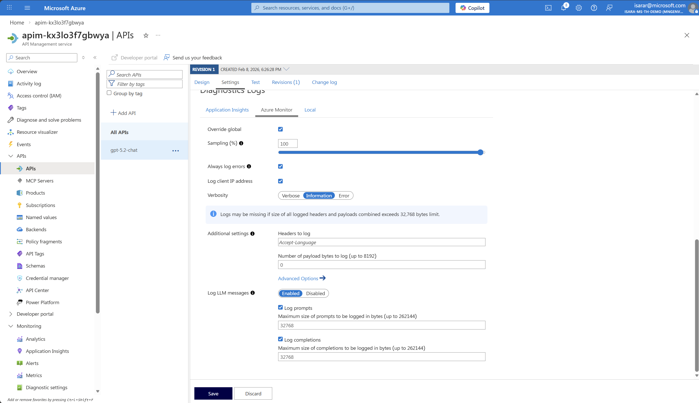
1. Click **Save** to save the change

</details>

### 02: Inspect and configure the API policy

After enabling monitoring, you need to verify that the token tracking policy is properly configured and add any additional dimensions you want to track.

<details markdown="block">
<summary><strong>Expand this section to view the solution</strong></summary>

1. While still in your Azure OpenAI API in API Management, select the **Design** tab.

1. You should see the policy configuration with token tracking dimensions. The policy may already include:
   - Prompt tokens
   - Completion tokens
   - Total tokens

1. If you want to add additional dimensions for tracking, you can edit the policy by:
   - Selecting the **All operations** scope
   - Selecting **</>** (Code editor) in the Inbound processing section
   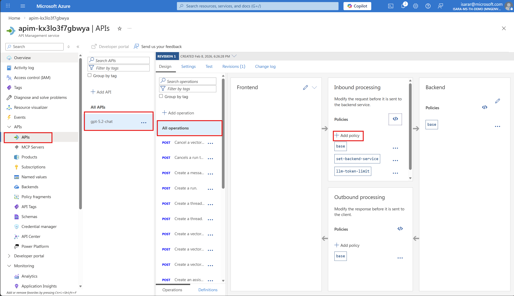
   - Adding or modifying the `azure-openai-emit-token-metric` policy
   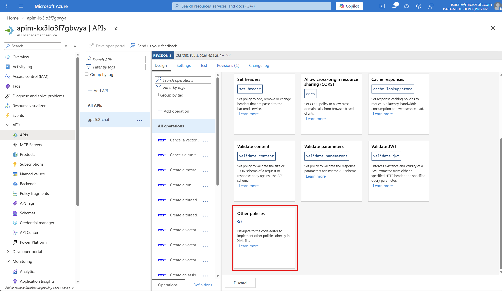

1. Example policy snippet:
   ```xml
   <azure-openai-emit-token-metric namespace="gpt-5.2-chat">
     <dimension name="API ID" />
     <dimension name="Product ID" />
     <dimension name="Subscription ID" />
     <dimension name="User ID" />
   </azure-openai-emit-token-metric>
   ```
  

1. Select **Save** after making any policy changes.

</details>

### 03: Test the API and generate token metrics

To verify that monitoring is working correctly, you need to send test requests to your Azure OpenAI API and generate token consumption data.

<details markdown="block">
<summary><strong>Expand this section to view the solution</strong></summary>

1. In your Azure OpenAI API, select the **Test** tab.

1. Select the **Creates a completion for the chat message** operation (or similar chat completion endpoint).

1. Fill in the required parameters:

   | Setting | Value | Description |
   |---------|-------|-------------|
   | **deployment-id** | `gpt-5.2-chat` | Your Azure OpenAI deployment name (verify in Azure AI Foundry) |
   | **api-version** | `2025-03-01-preview` | A supported API version |

1. In the **Request body** section, enter the following JSON:

   ```json
   {
     "messages": [
       {
         "role": "system",
         "content": "you are a friendly assistant"
       },
       {
         "role": "user",
         "content": "how is the weather in Bangkok?"
       }
     ]
   }
   ```

1. Select **Send** to execute the request.

1. You should receive a successful response (HTTP 200) with the AI-generated completion.

1. **Run multiple test requests** with different prompts to generate enough data for meaningful metrics. Try variations like:
   - Short prompts (e.g., "Hello")
   - Longer prompts (e.g., "Explain the concept of machine learning in detail")
   - Different conversation contexts

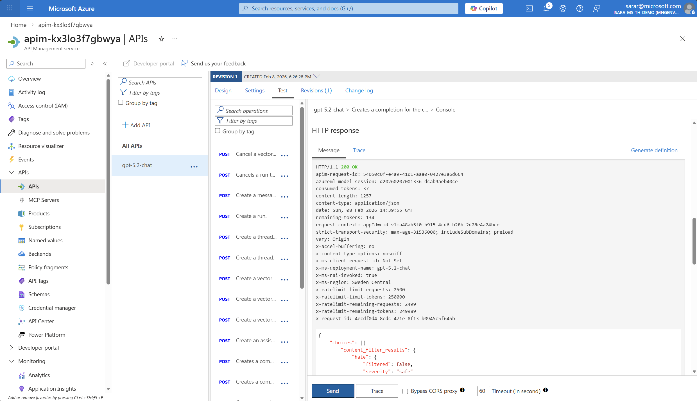

{: .note }
> Make sure to run at least 5-10 test requests to generate sufficient data for viewing in Application Insights. Metrics may take a few minutes to appear in the dashboard.

</details>

### 04: View token consumption metrics in Application Insights

After generating test data, you can view the token consumption metrics in Application Insights to analyze your AI usage patterns.

<details markdown="block">
<summary><strong>Expand this section to view the solution</strong></summary>

1. In your API Management instance, navigate to **Monitoring** > **Application Insights** in the left menu.
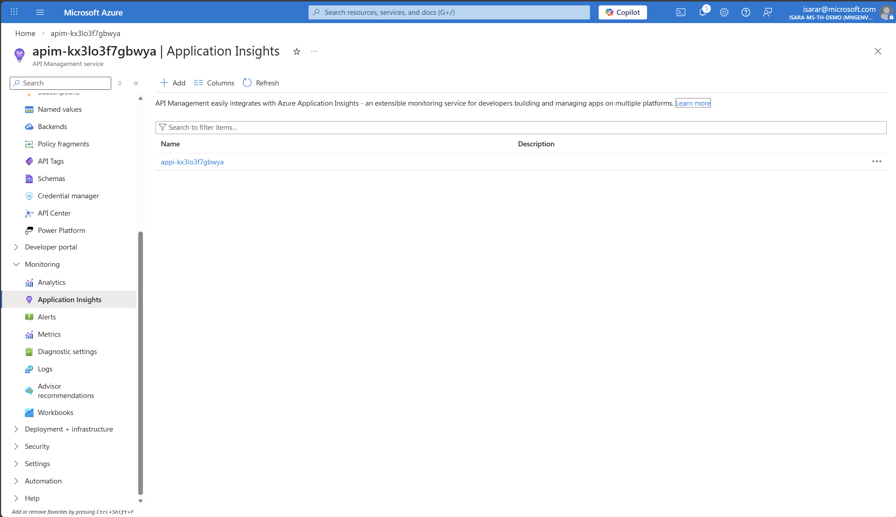

1. Select your Application Insights instance to open it.
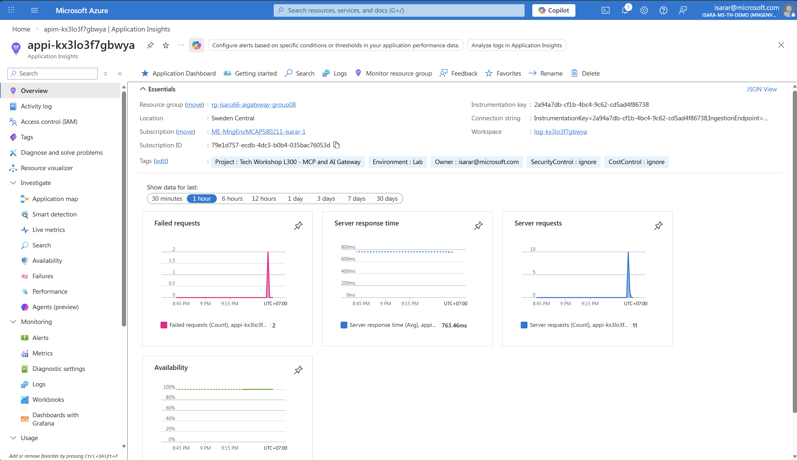

1. In Application Insights, select **Monitoring** > **Metrics** from the left menu.

1. In the metrics dashboard, configure the following:
   - **Scope**: Your Application Insights instance (should be pre-selected)
   - **Metric Namespace**: Select **azure api management/service** from the dropdown
   - **Metric**: Add the following metrics one by one by selecting **+ Add metric**:
     - **Prompt Tokens**
     - **Completion Tokens**
     - **Total Tokens**
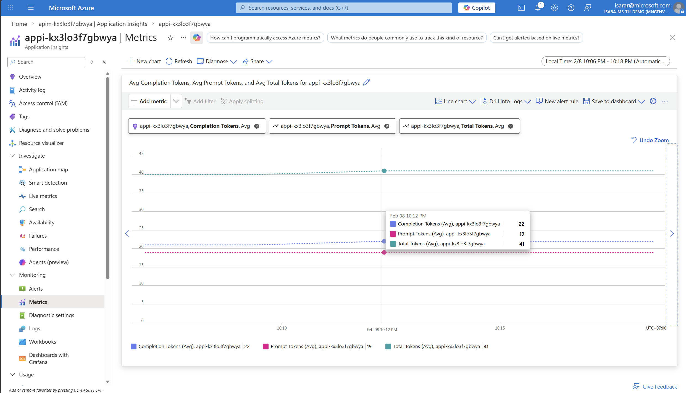

1. Adjust the time range to show recent data (e.g., Last 30 minutes or Last hour).

1. You should see a graph showing your token consumption across the test requests you made:
   - **Prompt Tokens**: Number of tokens in your input messages 
   - **Completion Tokens**: Number of tokens in the AI-generated responses
   - **Total Tokens**: Combined total

{: .note }
> The metrics shown are aggregated values. You can change the aggregation type (Sum, Average, Max, etc.) and apply filters by dimensions like API ID or Deployment ID to drill down into specific usage patterns.

### Understanding the Metrics

- **Prompt Tokens**: Represents the "input cost" - tokens you send to the model
- **Completion Tokens**: Represents the "output cost" - tokens the model generates
- **Total Tokens**: The sum of prompt and completion tokens, which determines your total API usage cost

By monitoring these metrics, you can:
- **Identify cost drivers**: Which applications or endpoints consume the most tokens
- **Optimize prompts**: Reduce unnecessary token usage by refining input messages
- **Plan capacity**: Forecast future usage and budget accordingly
- **Ensure fairness**: Distribute token quotas fairly across teams or applications

</details>

### 05: View token consumption metrics in APIM Log Analytics

In addition to Application Insights metrics, you can query detailed token consumption logs directly in API Management's Log Analytics workspace for more granular analysis.

<details markdown="block">
<summary><strong>Expand this section to view the solution</strong></summary>

1. In your API Management instance, navigate to **Monitoring** > **Logs** in the left menu.

1. Close the default queries popup if it appears.

1. In the query editor, enter the following KQL query to view token consumption:

   ```
   ApiManagementGatewayLlmLog
   | take 10
   ```

1. Click **Run** to execute the query.

1. You should see results showing:
   - **PromptTokens**: Number of tokens in your input messages
   - **CompletionTokens**: Number of tokens in the AI-generated responses
   - **TotalTokens**: Combined total
   - **OperationName**: The API operation called
   - **CorrelationId**: Unique identifier for each request
   - **Region**: The region where the request was processed
   - **SequenceNumber**: The sequence of the request

1. **Adjust the time range** at the top of the page (e.g., Last 24 hours) to view data from your test period.

1. **Optional**: Create more advanced queries for analysis:

   ```
   // View total token consumption by operation
   ApiManagementGatewayLlmLog
   | summarize TotalPromptTokens = sum(PromptTokens), 
            TotalCompletionTokens = sum(CompletionTokens),
            TotalTokens = sum(TotalTokens),
            RequestCount = count()
   ```

   ```
   // View token consumption over time (hourly) - render as timechart
   ApiManagementGatewayLlmLog
   | summarize AvgPromptTokens = avg(PromptTokens),
               AvgCompletionTokens = avg(CompletionTokens),
               TotalTokens = sum(TotalTokens)
   by bin(TimeGenerated, 5m)
   | order by TimeGenerated desc
   | render timechart 
   ```

   ```
   // View individual requests with token details
   ApiManagementGatewayLlmLog
   | where SequenceNumber == 0
   | project TimeGenerated, OperationName, PromptTokens, CompletionTokens, TotalTokens, CorrelationId
   | order by TimeGenerated desc
   | take 50
   ```

1. **Optional**: Pin queries to a dashboard by clicking **Pin to dashboard** for ongoing monitoring.

to retrieve Azure OpenAI pricing data for your region. 
[Azure OpenAPI pricing page](https://azure.microsoft.com/en-us/pricing/details/azure-openai/?msockid=3ec7efb751fd6653062cfa7550fc67fc)

Alternatively, You can use the [Azure Retail Prices API](https://prices.azure.com/api/retail/prices?currencyCode='USD'&$filter=(productName%20eq%20'Azure%20OpenAI'%20or%20productName%20eq%20'Azure%20OpenAI%20GPT5')%20and%20unitOfMeasure%20eq%20'1M'%20and%20armRegionName%20eq%20'swedencentral') to calculate estimated costs based on your token consumption metrics

{: .note }
> Log Analytics provides more flexibility than Application Insights metrics for detailed analysis, filtering, and correlation with other API Management logs. Use it when you need to investigate specific requests or analyze token consumption patterns in detail.

</details>
