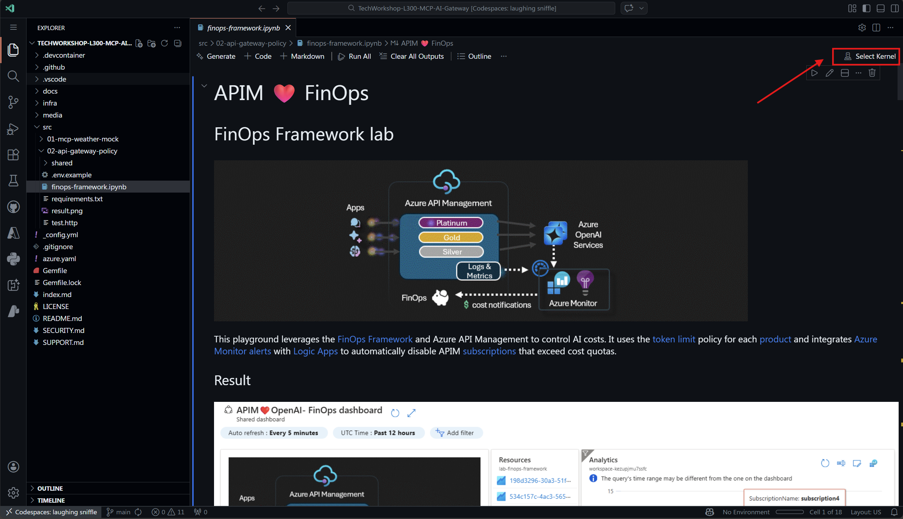
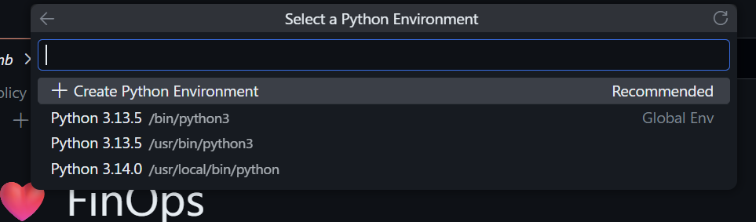
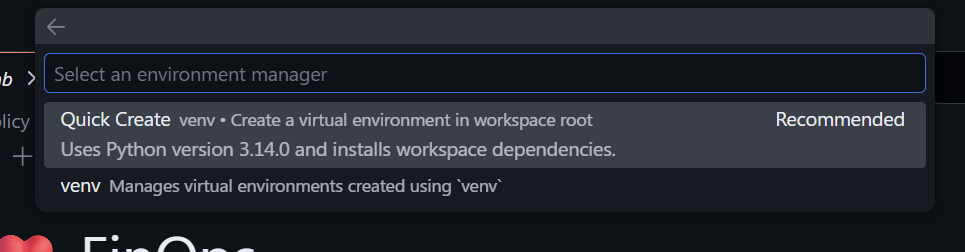
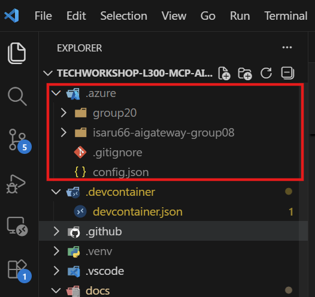
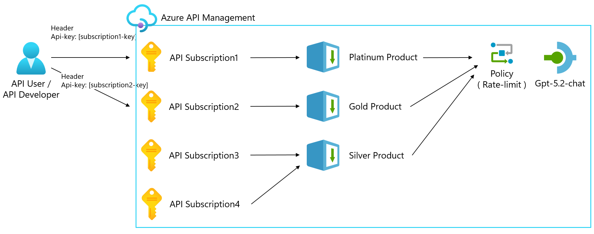
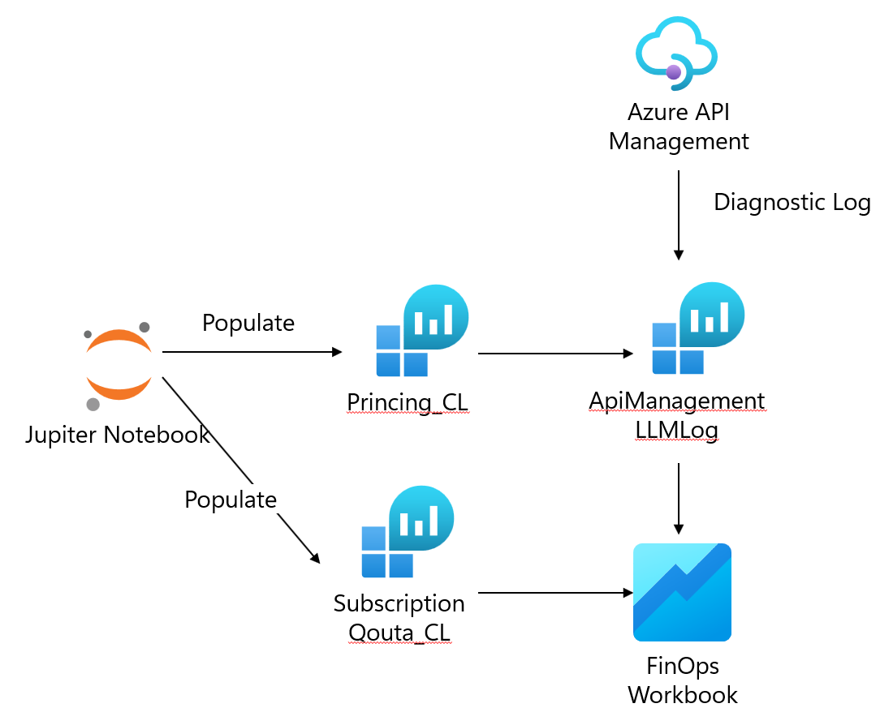
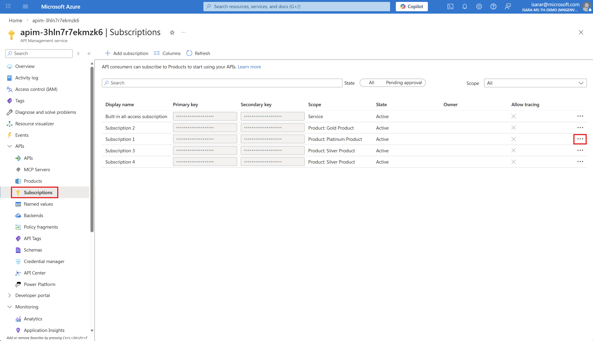
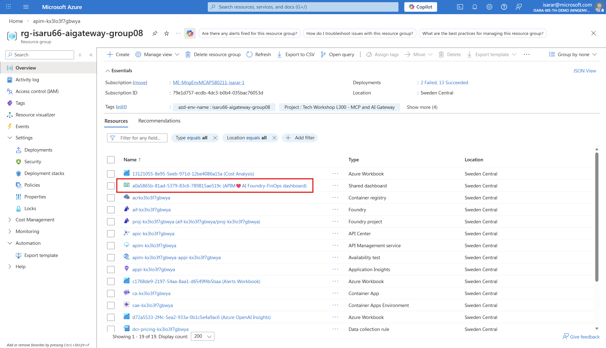

# Exercise 04 - Implement FinOps Framework for AI Cost Management

## Introduction

The [FinOps Framework](https://www.finops.org/framework/) provides a structured approach to cloud financial management, helping organizations optimize AI costs while maintaining performance. In this exercise, you'll implement cost tracking, quota management, and automated alerts using Azure API Management token limits, Azure Monitor custom tables, and Logic Apps for automated subscription management.

By integrating retail pricing data with token consumption metrics, you'll gain visibility into actual AI costs per subscription and automatically enforce cost quotas to prevent budget overruns.

## Description

In this exercise, you will implement the FinOps framework for AI cost management by:
1. Loading retail pricing data into Azure Monitor custom tables
2. Configuring cost quotas for APIM product subscriptions
3. Setting up automated monitoring and alerting
4. Testing the complete cost management workflow
5. Analyzing costs using Azure Workbooks

## Success Criteria

- You have successfully loaded retail pricing data into Azure Monitor custom tables
- You have configured cost quotas for each APIM product subscription
- You have tested API calls and verified token consumption tracking
- You have viewed cost analysis in Azure Workbooks showing actual spending vs. quotas
- You understand how the automated alert system works to disable subscriptions exceeding quotas

## Learning Resources

- [FinOps Framework](https://www.finops.org/framework/)
- [Azure API Management Token Limit Policy](https://learn.microsoft.com/azure/api-management/azure-openai-token-limit-policy)
- [Azure Monitor Custom Logs](https://learn.microsoft.com/azure/azure-monitor/logs/custom-logs-overview)
- [Azure Monitor Data Collection Rules](https://learn.microsoft.com/azure/azure-monitor/essentials/data-collection-rule-overview)
- [Azure Retail Prices API](https://learn.microsoft.com/rest/api/cost-management/retail-prices/azure-retail-prices)
- [Azure OpenAI Pricing](https://azure.microsoft.com/pricing/details/azure-openai/)
- [Azure Monitor Alerts with Logic Apps](https://learn.microsoft.com/azure/azure-monitor/alerts/alerts-logic-apps)

## Key Tasks

### 01: Open the FinOps Framework Jupyter Notebook

The FinOps implementation is automated through a Jupyter notebook that orchestrates the entire cost management workflow.

<details markdown="block">
<summary><strong>Expand this section to view the solution</strong></summary>

1. In VS Code, navigate to the `src/02-api-gateway-policy` folder in your workspace.

1. Open the file `finops-framework.ipynb`.

1. Ensure you have the Jupyter extension installed in VS Code (it should have been installed during the initial setup).

1. Select the Python kernel, we will create new python kernel for Jupyther notebook



Select **Create Python Environment** to create new environment


Select **Quick Create** to create new environment


Wait for environment to be created.

1. Review the notebook structure - it contains the following key sections:
   - **Initialize notebook variables**: Configure deployment settings
   - **Verify Azure CLI**: Ensure proper authentication
   - **Verify azd deployment**: Confirm resources are deployed
   - **Get environment values**: Retrieve deployment outputs
   - **Display retail pricing**: View current AI model pricing
   - **Load pricing data**: Import pricing into Azure Monitor
   - **Load subscription quotas**: Configure cost limits
   - **Execute test runs**: Generate sample usage data
   - **View dashboards**: Analyze costs in workbooks

{: .note }
> This notebook automates the FinOps framework implementation. You can run all cells sequentially or execute them step by step for better understanding.

</details>

### 02: Verify Azure Developer CLI deployment

Before running the FinOps notebook, ensure that your Azure resources have been deployed successfully using `azd up`.

{: .warning }
> Due to cost & capacity limitation, we might not able to have everyone run `azd up`. To workarround see note below.

{: .note }
> If you did not run `azd up` by yourself, you copy environment file from someone in your group that run it.
you need to copy `.azure` folder to your root workspace directory. see image below




<details markdown="block">
<summary><strong>Expand this section to view the solution</strong></summary>

1. Open a terminal in VS Code (**Terminal** > **New Terminal**).

1. Navigate to the repository root:
   ```bash
   cd c:\DEV\TechWorkshop\TechWorkshop-L300-MCP-AI-Gateway
   ```

1. Check the azd environment status:
   ```bash
   azd env get-values
   ```

1. You should see output containing key deployment values such as:
   - `apim_gateway_url`: Your API Management gateway URL
   - `apim_service_name`: Your APIM service name
   - `pricingDCREndpoint`: Data Collection Rule endpoint for pricing
   - `subscriptionQuotaDCREndpoint`: Data Collection Rule endpoint for quotas

1. If the command fails or returns empty values, run the deployment:
   ```bash
   azd up
   ```

1. Once deployment completes successfully, proceed to the next step.

{: .note }
> The `azd up` command deploys all required Azure resources including APIM, Azure AI Foundry, Data Collection Rules, Log Analytics Workspace, and Azure Monitor workbooks.

</details>

### 03: Initialize and configure the FinOps notebook

In this step, you'll configure the notebook variables to match your deployment settings and verify connectivity to Azure.

Here is APIM configuration.


We will setup subscription monthly qouta ( how much each subscription can use it buddget per month)

<details markdown="block">
<summary><strong>Expand this section to view the solution</strong></summary>

1. In the `finops-framework.ipynb` notebook, locate Cell 3 (Initialize notebook variables).

1. Review the configuration variables:
   - `aiservices_config`: AI Foundry location configuration
   - `models_config`: Azure OpenAI model definitions with pricing SKUs
   - `apim_products_config`: Product tiers with token limits and cost quotas
   - `apim_subscriptions_config`: Subscription assignments to products

1. **Optional**: Modify the configuration to match your requirements:
   ```python
   apim_products_config = [
       {"name": "platinum", "displayName": "Platinum Product", "tpm": 2000, 
        "tokenQuota": 1000000, "tokenQuotaPeriod": "Monthly", "costQuota": 15},
       {"name": "gold", "displayName": "Gold Product", "tpm": 1000, 
        "tokenQuota": 1000000, "tokenQuotaPeriod": "Monthly", "costQuota": 10}, 
       {"name": "silver", "displayName": "Silver Product", "tpm": 500, 
        "tokenQuota": 1000000, "tokenQuotaPeriod": "Monthly", "costQuota": 5}
   ]
   ```

{: .note }
> The configuration defines three product tiers (Platinum, Gold, Silver) with different cost quotas ($15, $10, $5). The FinOps framework will automatically enforce these limits.

</details>

### 04: Load retail pricing data into Azure Monitor

This step fetches current AI model pricing from the Azure Retail Prices API and loads it into a custom Azure Monitor table for cost calculations.
We will insert Princing data into Log Analytic custom table (**PricingCL**), so that we can convert token usage to pricing in USD.



<details markdown="block">
<summary><strong>Expand this section to view the solution</strong></summary>

1. In the notebook, run Cell 9 (Display retail pricing info) to view current pricing:
   ```python
   prices = requests.get(f"https://prices.azure.com/api/retail/prices?...")
   ```

1. You should see a table displaying pricing for each model in your configured region:
   
   | Region | SKU | Retail Price (per 1K tokens) |
   |--------|-----|------------------------------|
   | swedencentral | GPT 5.2 chat inp Gl | $0.0025 |
   | swedencentral | GPT 5.2 chat opt Gl | $0.0100 |

1. Run Cell 11 (Load pricing data into Azure Monitor) to import prices:
   ```python
   client = LogsIngestionClient(endpoint=pricing_dcr_endpoint, ...)
   ```

1. The script will:
   - Fetch retail prices for all configured models
   - Calculate per-1K-token costs for input and output tokens
   - Upload pricing data to Azure Monitor custom table using Data Collection Rules

1. Verify successful upload - you should see messages like:
   ```
   ℹ️ Adding model gpt-5.2-chat (source: 1M) with input / output tokens price 2.5 / 10.0
   ✓ Upload succeeded for model gpt-5.2-chat
   ```

1. **Understanding the pricing data**:
   - Input tokens are typically cheaper than output tokens
   - Prices vary significantly between models (e.g., GPT-5-nano vs GPT-5.2-chat)
   - Global Standard SKUs may have different pricing than regional deployments

{: .note }
> The pricing data is loaded into a custom Azure Monitor table called `PricingData_CL`. This data is used by Kusto queries in the Cost Analysis workbook to calculate actual spending based on token consumption.

</details>

### 05: Configure subscription cost quotas

In this step, you'll load cost quota limits for each APIM subscription into Azure Monitor, enabling automated quota enforcement.

<details markdown="block">
<summary><strong>Expand this section to view the solution</strong></summary>

1. In the notebook, run Cell 13 (Load Subscription Quota) to configure quotas:
   ```python
   client = LogsIngestionClient(endpoint=subscription_quota_dcr_endpoint, ...)
   ```

1. The script will:
   - Match each subscription to its product tier
   - Extract the cost quota from the product configuration
   - Upload quota data to Azure Monitor custom table

1. Verify successful upload - you should see messages like:
   ```
   ℹ️ Adding subscription1 with cost quota 15
   ✓ Upload succeeded for subscription1
   ```

1. **How quotas work in the FinOps framework**:
   - Each product tier has a defined `costQuota` (in USD)
   - Subscriptions assigned to a product inherit that quota
   - Azure Monitor alerts compare actual spending against quotas
   - Logic Apps automatically disable subscriptions when quotas are exceeded

1. **Example quota configuration**:
   - **Platinum** ($15): High-value applications with generous budgets
   - **Gold** ($10): Standard production applications
   - **Silver** ($5): Development/testing environments

{: .note }
> The quota data is stored in a custom Azure Monitor table called `SubscriptionQuota_CL`. Azure Monitor alert rules query this table along with token consumption data to detect quota violations.

</details>

### 06: Test the FinOps implementation with HTTP requests

Now you'll generate test traffic using the REST Client extension in VS Code to simulate real-world API usage and validate cost tracking.

<details markdown="block">
<summary><strong>Expand this section to view the solution</strong></summary>

1. In VS Code, navigate to the `src/02-api-gateway-policy` folder in your workspace.

1. Open the file `test.http`.

1. Ensure you have the [REST Client extension](https://marketplace.visualstudio.com/items?itemName=humao.rest-client) installed in VS Code.

1. Create or verify your `.env` file in the same directory with the following variables:
   ```bash
   APIM_GATEWAY_URL=https://YOUR-APIM-NAME.azure-api.net
   INFERENCE_API_PATH=inference
   API_VERSION=2025-03-01-preview
   SUBSCRIPTION1_KEY=YOUR-SUBSCRIPTION1-KEY-HERE
   SUBSCRIPTION2_KEY=YOUR-SUBSCRIPTION2-KEY-HERE
   SUBSCRIPTION3_KEY=YOUR-SUBSCRIPTION3-KEY-HERE
   SUBSCRIPTION4_KEY=YOUR-SUBSCRIPTION4-KEY-HERE
   ```
   you will lookup **subscription key** in your **Azure API Management** as below

1. **Get your subscription keys**:

   - Navigate to your APIM instance in Azure Portal → **Subscriptions** → Copy the primary keys



1. **Understanding the test file structure**:
   - The file contains multiple HTTP requests, one for each subscription
   - Each request tests a different product tier (Platinum, Gold, Silver)
   - Variables are loaded from the `.env` file using `{{$dotenv VARIABLE_NAME}}`

1. **Run a single test request**:
   - Place your cursor on any request (e.g., "Test with Subscription 1")
   - Click the **Send Request** link above the request, or press `Ctrl+Alt+R` (Windows/Linux) or `Cmd+Alt+R` (Mac)

1. You should see a response window appear with output like:
   ```json
   {
     "id": "chatcmpl-...",
     "object": "chat.completion",
     "created": 1738880234,
     "model": "gpt-5.2-chat",
     "choices": [
       {
         "index": 0,
         "message": {
           "role": "assistant",
           "content": "I cannot tell you the current time..."
         },
         "finish_reason": "stop"
       }
     ],
     "usage": {
       "prompt_tokens": 15,
       "completion_tokens": 42,
       "total_tokens": 57
     }
   }
   ```

1. **Test different subscription tiers**:
   - Run the **Subscription 1 (Platinum)** request - should have highest TPM limit (2000)
   - Run the **Subscription 2 (Gold)** request - medium TPM limit (1000)
   - Run the **Subscription 3 & 4 (Silver)** requests - lower TPM limit (500)

1. **Testing rate limits**:
   - Rapidly send multiple requests using the same subscription
   - You may encounter a `429 Too Many Requests` error when hitting the TPM limit
   - This demonstrates the token limit policy enforcement

1. **Understanding the test results**:
   - **HTTP 200**: Request processed successfully
   - **HTTP 429**: Rate limit exceeded (TPM quota for that product tier)
   - **HTTP 401/403**: Invalid subscription key or suspended subscription
   - Each successful request generates token consumption data tracked in Azure Monitor

1. **What happens behind the scenes**:
   - APIM receives the request and validates the subscription key
   - Token limit policy checks TPM quota for the product
   - Request is forwarded to Azure AI Foundry model endpoint
   - Response tokens are counted and logged to Azure Monitor
   - Emit token metric policy records consumption for cost calculation

1. **Optional**: Modify the test requests:
   - Change the `model` parameter to test different AI models
   - Adjust `max_completion_tokens` to control response length
   - Modify the `content` message to test different prompts

{: .note }
> Using the REST Client extension provides a quick way to test individual subscription keys and product tiers without writing code. For automated testing scenarios, you can still use the notebook cell or create a Python script.

</details>

### 07: Analyze costs using Azure Workbooks

Finally, you'll use Azure Workbooks to visualize costs, compare spending against quotas, and identify optimization opportunities.

<details markdown="block">
<summary><strong>Expand this section to view the solution</strong></summary>

1. Navigate to the [Azure Portal](https://portal.azure.com/). Then open dashboard



1. The workbook displays:
   - **Total Costs by Subscription**: Bar chart showing spending per subscription
   - **Cost vs. Quota**: Comparison of actual costs against configured limits
   - **Model Usage**: Breakdown of costs by AI model
   - **Token Consumption Trends**: Time-series chart of token usage
   - **Quota Compliance**: Percentage of quota consumed per subscription

{: .note }
> The Cost Analysis workbook uses Kusto queries to join token consumption logs with pricing data and quota configurations, providing real-time cost visibility without requiring manual calculations.

</details>

### 10: FinOps best practices and optimization tips

<details markdown="block">
<summary><strong>Expand this section to view the solution</strong></summary>

Based on the FinOps Framework principles, here are recommended practices for ongoing AI cost management:

**1. Visibility & Allocation**
- **Tag all resources**: Use Azure tags to track costs by team, project, or cost center
- **Implement showback/chargeback**: Use Azure Cost Management to allocate AI costs to business units
- **Regular cost reviews**: Schedule monthly reviews of the Cost Analysis workbook
- **Monitor trends**: Watch for unexpected spikes in token consumption

**2. Optimization**
- **Right-size model selection**: Use smaller models (e.g., GPT-5-nano) for simple tasks
- **Optimize prompts**: Reduce unnecessary tokens in system messages and user prompts
- **Enable caching**: Use Azure OpenAI's prompt caching to reduce redundant token consumption
- **Implement semantic caching**: Cache similar queries at the application layer
- **Batch operations**: Process multiple requests together when possible

**3. Governance & Control**
- **Implement tiered access**: Assign users to appropriate product tiers based on needs
- **Regular quota reviews**: Adjust quotas based on actual usage patterns and business value
- **Cost anomaly detection**: Set up additional alerts for unusual spending patterns
- **Approval workflows**: Require approval for quota increases above certain thresholds

**4. Automation**
- **Auto-scaling quotas**: Implement Logic Apps to automatically adjust quotas based on business rules
- **Scheduled reports**: Send weekly cost summaries to stakeholders via email
- **Predictive alerting**: Use Azure Machine Learning to forecast quota exhaustion
- **Resource tagging automation**: Auto-tag API requests with metadata for granular cost tracking

**5. Cultural Change (FinOps Principle)**
- **Cost awareness training**: Educate developers on AI cost implications
- **Cost-conscious development**: Include cost considerations in sprint planning
- **Shared responsibility**: Make cost optimization everyone's responsibility, not just finance
- **Celebrate wins**: Recognize teams that successfully optimize AI spending

**6. Model-Specific Optimizations**
- **GPT-5-nano**: Use for simple classification, extraction, and summarization
- **GPT-5-mini**: Balance of cost and capability for most tasks
- **GPT-5.2**: Reserve for complex reasoning, coding, and creative tasks
- **Completion vs. Chat models**: Choose based on actual use case requirements

**7. Load Balancing & Resilience**
- **Multiple backend pools**: Distribute traffic across regions for cost optimization
- **Failover strategies**: Implement graceful degradation to cheaper models during high load
- **Priority queuing**: Route high-value requests to premium models, others to cost-effective options

**8. Continuous Improvement**
- **A/B testing**: Compare model performance vs. cost regularly
- **Feedback loops**: Collect user satisfaction data to validate model selection
- **Regular audits**: Review and remove unused subscriptions and products
- **Stay updated**: Monitor Azure pricing changes and new model releases

{: .note }
> The FinOps Framework emphasizes that cost optimization is an ongoing practice, not a one-time setup. Schedule quarterly reviews of your implementation and adjust based on business changes and new Azure capabilities.

</details>

## Summary

Congratulations! You have successfully implemented the FinOps Framework for AI cost management using Azure API Management and Azure Monitor. You now have:

✅ **Automated pricing data collection** from Azure Retail Prices API  
✅ **Cost quota enforcement** per APIM subscription and product tier  
✅ **Real-time cost tracking** with custom Azure Monitor tables  
✅ **Automated alerts and remediation** using Logic Apps  
✅ **Comprehensive cost visibility** through Azure Workbooks  

### Key Takeaways

1. **FinOps is a cultural shift**: Cost optimization requires collaboration between engineering, finance, and business teams.

2. **Visibility enables optimization**: You can't optimize what you can't measure - comprehensive cost tracking is the foundation.

3. **Automation scales governance**: Manual quota enforcement doesn't scale; automated alerts and remediation ensure consistent policy enforcement.

4. **Right-sizing matters**: Using the appropriate AI model for each task can reduce costs by 10-100x without sacrificing quality.

5. **Continuous monitoring**: AI cost management is an ongoing practice that requires regular review and adjustment.

### Next Steps

- **Exercise 05**: Explore advanced **MCP (Model Context Protocol)** integration patterns
- **Production deployment**: Adapt this implementation to your organization's requirements
- **Advanced features**: Implement predictive cost forecasting using Azure Machine Learning
- **Integration**: Connect cost data to your existing FinOps or cloud management platforms

### Additional Resources

- [FinOps Foundation](https://www.finops.org/)
- [Azure FinOps Guide](https://learn.microsoft.com/azure/cost-management-billing/finops/)
- [Azure OpenAI Cost Management](https://learn.microsoft.com/azure/ai-services/openai/how-to/manage-costs)
- [APIM Token Limit Policy](https://learn.microsoft.com/azure/api-management/azure-openai-token-limit-policy)
- [Azure Monitor Custom Logs](https://learn.microsoft.com/azure/azure-monitor/logs/custom-logs-overview)

---

{: .note }
> **Clean up resources**: When you're finished with this lab, use the clean-up notebook to remove all deployed resources and avoid unnecessary charges: `src/02-api-gateway-policy/clean-up-resources.ipynb`
