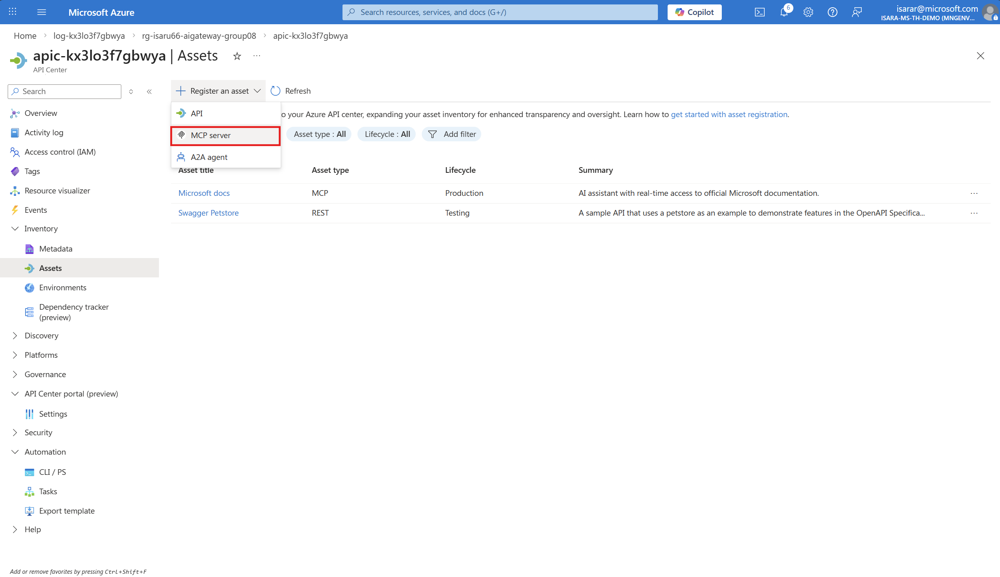
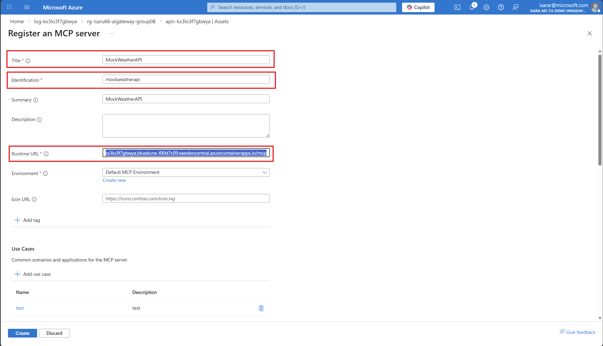
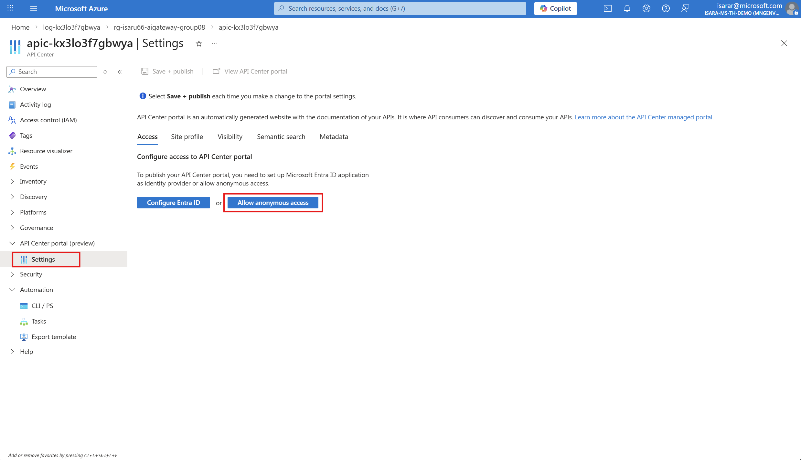
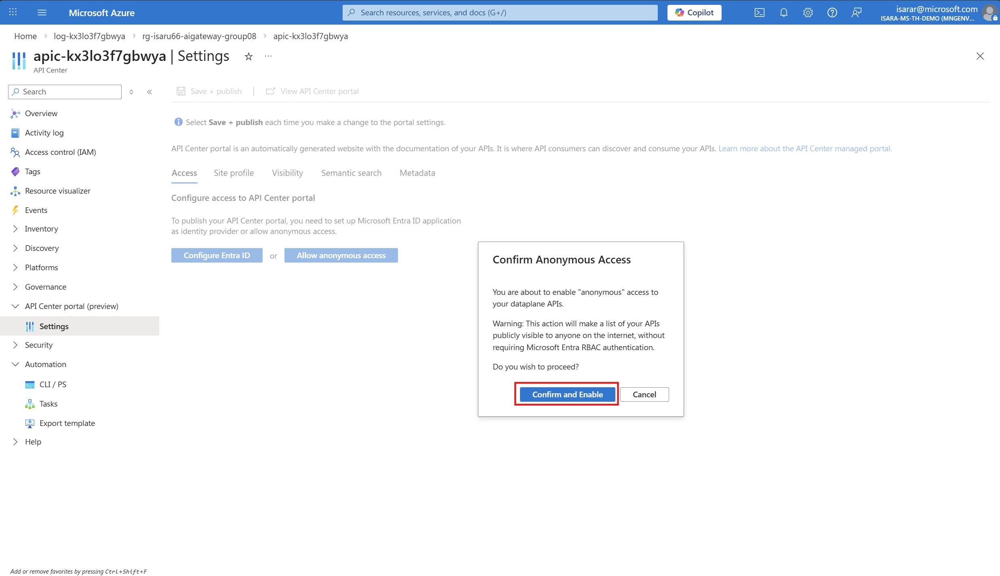
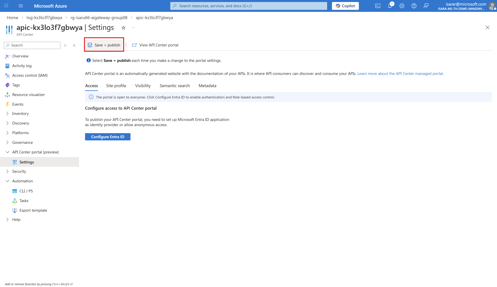
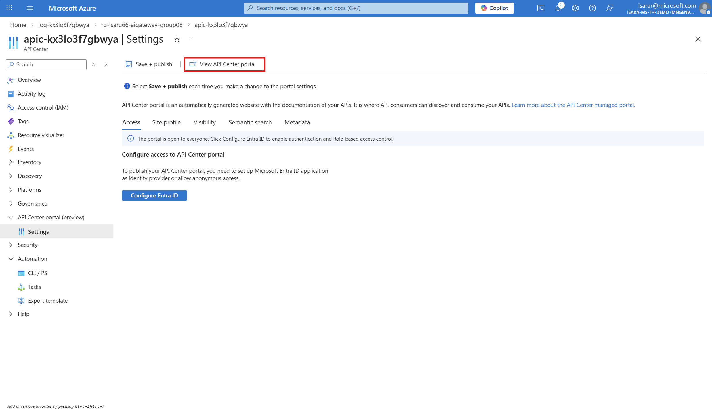
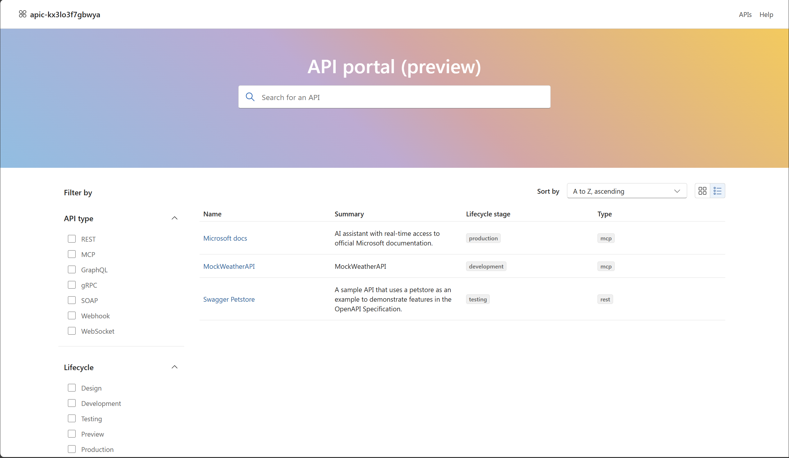

# Exercise 07 - Azure API Center for MCP Discovery

## Introduction

Azure API Center provides a centralized inventory for discovering and managing APIs across your organization, including Model Context Protocol (MCP) servers. MCP servers expose backend APIs and data sources in a standardized way to AI agents and models. By registering your MCP servers in API Center and publishing the API Center portal, you enable developers and stakeholders to easily discover and consume these resources.

## Description

In this exercise, you will register MCP servers in your Azure API Center inventory and publish the API Center portal to enable discovery and consumption. You will learn how to manually register MCP servers, use partner MCP servers from the curated list, and configure the portal for public access.

## Success Criteria

- You have registered at least one MCP server in your API Center inventory.
- You have configured and published the API Center portal.
- You can access the API Center portal and discover registered MCP servers.

## Learning Resources

- [Register and discover remote MCP servers](https://learn.microsoft.com/azure/api-center/register-discover-mcp-server)
- [Set up your API Center portal](https://learn.microsoft.com/azure/api-center/set-up-api-center-portal)
- [About MCP servers in API Management](https://learn.microsoft.com/azure/api-management/mcp-server-overview)

## Key Tasks

### 01: Manually register an MCP server in Azure API Center

In addition to partner MCP servers, you can manually register your own MCP servers in the API inventory by specifying the API type as MCP.

<details markdown="block">
<summary><strong>Expand this section to view the solution</strong></summary>

#### Create the MCP API entry

1. In your API Center instance, select **APIs** from the left menu.


1. Select **+ Register API** to create a new API entry.

1. Fill in the registration details:
   - **API title**: Enter a descriptive name (e.g., "Weather MCP Server")
   - **API type**: Select **MCP** from the dropdown
   - **Version**: Specify a version (e.g., "1.0")
   - **Lifecycle stage**: Choose appropriate stage (e.g., "Development", "Production")


1. Select **Register an Asset** -> **MCP** to register the API.




#### Add environment and deployment


1. Register the MCP server with the following details:
   - **Title**: Enter a descriptive name (e.g., "MockWeatherAPI")
   - **Identification**: Enter a unique identifier (e.g., "mockweatherapi")
   - **Summary**: Enter a brief summary (e.g., "MockWeatherAPI")
   - **Runtime URL**: Enter the runtime URL for the MCP server (e.g., `https://iosai7piovya.bluedesim-fkk07cd9.swedencentral.azurecontainerapps.io/mcp`)
   - **Environment**: Select the environment (e.g., "Default MCP Environment")
   - **Icon URL**: (Optional) Enter an icon URL for the MCP server



</details>

### 03: Configure and publish the API Center portal

After registering your MCP servers, publish the API Center portal to enable discovery and consumption by developers and stakeholders in your organization.

<details markdown="block">
<summary><strong>Expand this section to view the solution</strong></summary>

#### Set up Microsoft Entra app registration (Automatic)

1. In the [Azure portal](https://portal.azure.com/), navigate to your API Center instance.


   

1. In the left menu, select **API Center portal** > **Settings**.
1. On the **Access Tab** tab, select **Allow Annonymous Access**.

   

1. click **Confirm and Enable**.

   

1. click **Save + Publish**.

   

1. On the **View** tab

   

{: .note }
> The automatic setup creates a Microsoft Entra app registration named `<api-center-name>-apic-aad`. You can find it under **App registrations** in Microsoft Entra ID if needed.

#### Configure portal settings (Optional)

1. On the **Settings** page, explore additional tabs to customize your portal:
   - **General**: Basic portal settings
   - **Branding**: Customize portal name and appearance
   - **Security**: Configure access controls

1. Make any desired customizations.

1. Select **Save + publish** to apply changes.

</details>

### 04: Access and verify the API Center portal

After publishing the portal, verify that you can access it and discover the registered MCP servers.

<details markdown="block">
<summary><strong>Expand this section to view the solution</strong></summary>

#### Access the portal

1. On the portal's **Settings** page in the Azure portal, select **View API Center portal** to open it in a new tab.

   

   Or, navigate directly using the URL format:
   ```
   https://<api-center-name>.portal.<location>.azure-apicenter.ms
   ```
   Replace `<api-center-name>` and `<location>` with your API Center name and deployment location.

{: .note }
> By default, the portal home page is publicly accessible but requires sign-in to access API details.

#### Configure anonymous access (Optional)

For anonymous public access to the portal without sign-in requirement:

1. In the Azure portal, navigate to your API Center instance.

1. Select **API Center portal** > **Settings**.

1. On the **Security** tab, configure public access settings:
   - Enable **Allow anonymous access** to allow users to browse APIs without signing in
   - Configure what information is visible to anonymous users

1. Select **Save + publish**.

{: .warning }
> Consider your organization's security requirements before enabling anonymous access. You may want to restrict sensitive API details to authenticated users only.

#### Verify MCP server discovery

1. In the API Center portal, use the search bar to find your registered MCP servers.

1. Filter APIs by type:
   - Select **Type** filter
   - Choose **MCP** to show only MCP servers

1. Select an MCP server to view its details:
   - API description and metadata
   - Deployment endpoint URL (if configured)
   - OpenAPI definition (if available)
   - Documentation and lifecycle stage

1. Verify that users can:
   - Browse and discover MCP servers
   - View server details and endpoints
   - Download API definitions

</details>

### 05: Enable user access to the API Center portal (Optional)

To enable specific Microsoft Entra users or groups to sign in and access APIs in the portal, assign the Azure API Center Data Reader role.

<details markdown="block">
<summary><strong>Expand this section to view the solution</strong></summary>

1. In the [Azure portal](https://portal.azure.com/), navigate to your API Center instance.

1. In the left menu, select **Access control (IAM)** > **+ Add role assignment**.

1. On the **Role** page:
   - Search for and select **Azure API Center Data Reader**
   - Select **Next**

1. On the **Members** page:
   - In **Assign access to**, select **User, group, or service principal**
   - Select **+ Select members**
   - Search for and select the users or groups to grant access
   - Select **Select** and then **Next**

1. Review the role assignment and select **Review + assign**.

{: .note }
> By default, administrators must also be assigned the Azure API Center Data Reader role to access APIs in the portal after signing in.

{: .tip }
> To streamline access for new users, consider assigning the role to a Microsoft Entra group and configuring a dynamic group membership rule.

</details>

## Summary

In this exercise, you learned how to:
- Register partner MCP servers from the curated list in Azure API Center
- Manually register custom MCP servers with environments, deployments, and API definitions
- Configure and publish the API Center portal for discovery
- Enable anonymous or authenticated access to the portal
- Assign user permissions for accessing APIs in the portal

By registering your MCP servers in Azure API Center and publishing the portal, you provide a centralized discovery experience that helps developers and stakeholders find, understand, and consume MCP servers across your organization.
- **Ensure fairness**: Distribute token quotas fairly across teams or applications

</details>

### 05: View token consumption metrics in APIM Log Analytics

In addition to Application Insights metrics, you can query detailed token consumption logs directly in API Management's Log Analytics workspace for more granular analysis.

<details markdown="block">
<summary><strong>Expand this section to view the solution</strong></summary>

1. In your API Management instance, navigate to **Monitoring** > **Logs** in the left menu.

1. Close the default queries popup if it appears.

1. In the query editor, enter the following KQL query to view token consumption:

   ```
   ApiManagementGatewayLlmLog
   | take 10
   ```

1. Click **Run** to execute the query.

1. You should see results showing:
   - **PromptTokens**: Number of tokens in your input messages
   - **CompletionTokens**: Number of tokens in the AI-generated responses
   - **TotalTokens**: Combined total
   - **OperationName**: The API operation called
   - **CorrelationId**: Unique identifier for each request
   - **Region**: The region where the request was processed
   - **SequenceNumber**: The sequence of the request

1. **Adjust the time range** at the top of the page (e.g., Last 24 hours) to view data from your test period.

1. **Optional**: Create more advanced queries for analysis:

   ```
   // View total token consumption by operation
   ApiManagementGatewayLlmLog
   | summarize TotalPromptTokens = sum(PromptTokens), 
            TotalCompletionTokens = sum(CompletionTokens),
            TotalTokens = sum(TotalTokens),
            RequestCount = count()
   ```

   ```
   // View token consumption over time (hourly) - render as timechart
   ApiManagementGatewayLlmLog
   | summarize AvgPromptTokens = avg(PromptTokens),
               AvgCompletionTokens = avg(CompletionTokens),
               TotalTokens = sum(TotalTokens)
   by bin(TimeGenerated, 5m)
   | order by TimeGenerated desc
   | render timechart 
   ```

   ```
   // View individual requests with token details
   ApiManagementGatewayLlmLog
   | where SequenceNumber == 0
   | project TimeGenerated, OperationName, PromptTokens, CompletionTokens, TotalTokens, CorrelationId
   | order by TimeGenerated desc
   | take 50
   ```

1. **Optional**: Pin queries to a dashboard by clicking **Pin to dashboard** for ongoing monitoring.

to retrieve Azure OpenAI pricing data for your region. 
[Azure OpenAPI pricing page](https://azure.microsoft.com/en-us/pricing/details/azure-openai/?msockid=3ec7efb751fd6653062cfa7550fc67fc)

Alternatively, You can use the [Azure Retail Prices API](https://prices.azure.com/api/retail/prices?currencyCode='USD'&$filter=(productName%20eq%20'Azure%20OpenAI'%20or%20productName%20eq%20'Azure%20OpenAI%20GPT5')%20and%20unitOfMeasure%20eq%20'1M'%20and%20armRegionName%20eq%20'swedencentral') to calculate estimated costs based on your token consumption metrics

{: .note }
> Log Analytics provides more flexibility than Application Insights metrics for detailed analysis, filtering, and correlation with other API Management logs. Use it when you need to investigate specific requests or analyze token consumption patterns in detail.

</details>
